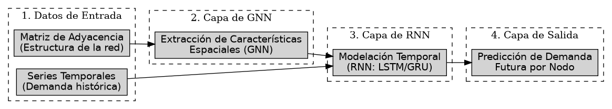

# Introducción

El sistema de transporte público en Santiago de Chile es un componente esencial para el funcionamiento de la ciudad. Cambios en su oferta, sean planificados o inesperados, pueden generar impactos significativos en la movilidad en los barrios cercanos, tanto a corto como a largo plazo.

Imagínese que usted es ingeniero de Red Metropolitana de  Movilidad (el sistema de transporte público de Santiago), y le encomiendan la ardua tarea de agregar nuevos recorridos a la red. A priori es una tarea fácil si es que se tiene dinero infinito, pero al tener restricciones en términos de recursos, tiene que tomar la difícil decisión de priorizar ciertas áreas. 
Tomando eso en cuenta, usted crea un documento extenso con los nuevos recorridos y la frecuencia de ellos. Finalmente, su propuesta es aprobada y comienzan a circular nuevos buses y recorridos. Después de un par de meses le llegan los primeros reportes de demanda de la red. Para su sorpresa, nota que algunos de los recorridos que ya existían (anteriores a los que usted propuso), tuvieron una notable bajada de demanda, en otras palabras, es dinero perdido. Los buses ahora pasan mas vacíos y Red pierde millones de pesos en cargar a los vehículos eléctricos y pagándole a conductores que no recogen a casi ningún pasajero. Usted se encuentra en un dilema. Modificar la red genera cambios en otros recorridos, y pensar en cada cambio posible parece una tarea titánica.  Usted se pregunta si hay alguna manera de generar datos de demanda sintéticos para analizar como cambia el resto de la red y su demanda ante sus cambios propuestos de manera mas sencilla.  

Generar la demanda sintética de una red de transporte en base a cambios nuevos (una redistribución de la demanda) es el objetivo de esta memoria. 

Una exploración bibliográfica sugiere que el campo de la predicción de la demanda usando técnicas de Inteligencia Artificial, ha crecido notablemente. Una exploración bibliográfica ayudada por el paper review de  Torrepadula et al. [@diTorrepadula2024], allanan el camino para entender cómo se ha abordado la predicción de la demanda de transporte público en distintas ciudades del mundo.

Torrepadula menciona que el problema de la demanda es de tipo pronóstico de series de tiempo. En ese sentido, se abren varias soluciones, como el uso de Redes Neuronales Recurrentes (RNN) o Long-Short Term Memory (LSTM), para analizar secuencias de datos temporales para predecir datos futuros. Podemos pensar en cómo, todos los días de semana, la curva de demanda sigue el mismo patrón, dos horarios peaks, uno a la hora de ida al trabajo, y otro a la hora de vuelta. Una red neuronal especializada en analizar secuencias ordenadas es idónea para esta tarea. Estas redes neuronales son ampliamente usadas en el estado del arte para predecir el flujo de pasajeros en líneas de Metro en China que mas adelante se mencionarán. 
Eso es por el lado del análisis temporal, pero es importante notar la correlación espacial de la red, sobre todo si ocurren cambios en ella. Debido a la naturaleza de Red o **set de puntos conectados**, se nos viene a la cabeza inmediatamente usar Redes Neuronales de Grafos, gracias a su versatilidad en la forma de los inputs, a diferencia de los MLP o las CNN las cuales reciben vectores o grillas (como las imágenes). 

Actualmente, algunos de los estudios que abordan esta problemática desde Chile lo hacen desde enfoques estadísticos y/o a nivel macro. Estos suelen analizar el antes y el después de una intervención, sin capacidad real de abstracción. Otros modelos tienen una orientación más predictiva, pero se encuentran desactualizados y no reflejan adecuadamente las dinámicas actuales del transporte urbano. También existen enfoques centrados en el transporte privado, que estudian cómo factores como la infraestructura, las tarifas o las políticas públicas afectan la movilidad general. Sin embargo, estos trabajos no se enfocan en cambios estructurales de la red de transporte público, sino que operan sobre la oferta ya existente.

Por otro lado, existe el sistema ADATRAP [@adatrap2025], desarrollado por la Universidad de Chile y el Instituto Sistemas Complejos de Ingeniería. ADATRAP es un software que analiza datos y permite planificar y crear estrategias para la priorización en la asignación de servicios públicos de transporte. El software toma en cuenta la distribución de la oferta para los usuarios del servicio en la Región Metropolitana. Adatrap será una fuente de datos importante para la predicción de la demanda.

Para finalizar, la solución propuesta en este proyecto se basa en el uso de técnicas de aprendizaje automático, modelando el sistema de transporte como un grafo en el que se representen recorridos, paradas y transbordos. Este modelo (sea uno discreto, como una MNL o una GNN) tendrá que aprender a predecir el comportamiento de los usuarios en función de múltiples factores, como la duración del viaje, el número de transbordos y el tiempo de espera. Estos modelos y sus resultados se compararán con datos reales de uso, para afinar el modelo y su precisión.
Finalmente, se realizarán simulaciones de diferentes escenarios, como la introducción de nuevas líneas o la eliminación de recorridos, para observar cómo estos cambios afectan la demanda y la distribución de usuarios en la red obteniendo datos de la red y su uso modelado usando técnicas de ML y grafos.

## Situación actual
Una gran motivación para este proyecto es la optimización en el uso de los recursos públicos. Modificar dinámicamente la frecuencia de los buses, crear nuevos recorridos o eliminar aquellos que han quedado obsoletos son decisiones que pueden tener un impacto significativo en la calidad del servicio y en la satisfacción de los usuarios. Sin embargo, estas decisiones deben basarse en datos precisos y actualizados sobre el uso del transporte público, así como en una comprensión profunda de cómo los cambios en la red afectan la demanda.

Siguiendo el trabajo de Torrepadula mas a fondo [@diTorrepadula2024] se abren muchas soluciones y consideraciones: 
La primera , el sujeto de la predicción. 

### Sujeto de la predicción : 
Diversos trabajos se enfocan tanto en: 

1. Cantidad de personas en una parada en la ruta. Trabajos como el de Wei et. al [@wei2022nonlinear] usan enfoques no lineales para estimar la demanda en algunas estaciones de metro.
2. Cantidad de personas en la ruta. El trabajo de Zhao [@zhao] utiliza Prophet para estimar las personas en la ruta 320 de Zhengzhou, China
3. Cantidad de personas en un vehículo. Algunos trabajos lo predicen , como el de Wang et. al[@li2022deep] con un Support Vector Machine mas un filtro de Kalman.
4. Cantidad de personas en un área. El trabajo de Wang et al [@wang2021passenger] explora predicciones espacio temporales con un modelo llamado GALLAT (GrAphic preddiction with ALL ATtention), que modela la red como un grafo 

Notar que cada enfoque o sujeto requiere un set de datos distintos, por ejemplo, para saber cuanta gente hay en un momento dado en un vehículo, debemos de usar cámaras o sensores, en cambio, para saber un estimado de gente en la ruta, podemos usar los datos de las validaciones de la tarjeta bip! de la ruta.

Por otro lado, todos los enfoques tienen el objetivo de predecir la demanda, pero cada uno de ellos tiene una metodología distinta de cómo hacerlo.

Un dato importante es el de como ADATRAP estima la cantidad de personas en la ruta[@adatrap2025]. ADATRAP tiene un algoritmo estimador de paradas de bajada de los usuarios. En sistemas como RED, el usuario solo valida en su subida al vehículo, por lo que no se sabe donde baja. La predicción se basa en el horario y ubicación de su subida al bus en la ida  y en el horario y ubicación de la vuelta. Se entiende como ida y vuelta como el primer y el último viaje del día.

Una exploración inicial indica que el curso ideal sería contar cuanta gente usa cada ruta, por ello es que la cantidad de personas en la ruta puede ser un buen candidato.

### Tipo de datos:

El tipo de datos es importante. Algunos ejemplos son:

1. Datos de validación de la tarjeta Bip! (que se puede usar para saber cuanta gente hay en una ruta, o en un área).

2. Datos de sensores (que se pueden usar para saber cuanta gente hay en un vehículo).

3. Datos de cámaras (que se pueden usar para saber cuanta gente hay en un vehículo, o en un área o un paradero).

4. GPS para el flujo de personas en un área.

Citando a Torrepadula [@diTorrepadula2024], los datos de validación de la tarjeta , como la Bip! o sus equivalentes en otros paises son los más utilizados, ya que son fáciles de obtener y tienen una buena cobertura geográfica. Sin embargo, también tienen limitaciones, como la falta de información sobre el origen y destino de los viajes. Los datos de sensores y cámaras son más precisos, pero son más difíciles de obtener y tienen una cobertura geográfica limitada. Los datos de GPS son muy precisos, pero también son difíciles de obtener y tienen una cobertura geográfica limitada.

Trabajos como los de Ye [@ye2022adaptive], Jian [@jiang2022gmm], Li [@li2021forecast] y Yang et.al utilizan datasets provenientes de tarjetas de validación con tecnología similar o idéntica a la de la tarjeta Bip!.

### Factores 

Los factores que afectan la demanda son diversos y pueden variar según el contexto. Algunos de los más relevantes son:

1. **Tarifas**: El costo del transporte público puede influir en la demanda, especialmente en áreas donde existen alternativas de transporte privado.

2. **Frecuencia**: La cantidad de buses o trenes disponibles en una ruta puede afectar la demanda, ya que una mayor frecuencia puede atraer a más usuarios.

3. **Tiempo de viaje**: La duración del trayecto es un factor clave en la decisión de utilizar el transporte público. Un tiempo de viaje más corto puede aumentar la demanda.

4. **Comodidad**: La calidad del servicio, como la limpieza, el confort y la seguridad, puede influir en la decisión de utilizar el transporte público.

5. **Accesibilidad**: La facilidad de acceso a las paradas o estaciones, así como la disponibilidad de servicios complementarios (como estacionamientos o bicicletas compartidas), puede afectar la demanda.

6. **Condiciones climáticas**: Factores como la lluvia, el frío o el calor extremo pueden influir en la decisión de utilizar el transporte público.

7. **Eventos especiales**: La realización de eventos masivos, como conciertos o ferias, puede generar picos de demanda en ciertas rutas.

8. **Fiestas y feriados**: La demanda de transporte público puede variar significativamente durante días festivos o feriados, lo que puede afectar la planificación de la oferta.

9. **Búsqueda Web** Los turistas, generalmente, se informan de las rutas y horarios de los buses en la web, por lo que el tráfico web puede ser un buen indicador de la demanda.

### Modo de transporte

En distintos trabajos, se exploró la predicción de distintos métodos de transporte. Entre ellos están el Metro, buses, trenes y tranvías.

### Técnicas de preprocesado de datos

Transformar los datos en una estructura de datos es un paso importante. GNNs requieren preprocesar los datos en matrices o grafos. Trabajos como los de Liu Et. Al[@liu2020physical] utilizan grafos representados por matrices del tipo (o,d), donde o es el origen y d es el destino de la persona. Predicciones hechas por ADATRAP [@adatrap2025] pueden ser utilizadas para llenar esta matriz de origen-destino. Otros enfoques, como el de Massobrio[@massobrio2020urban] modelan una red con nodos que representan las paradas de las rutas. 

### Técnicas de predicción

El área de interés de este trabajo son las soluciones que usan MNL o RNN y GNN/GCNN debido a la naturaleza de la creación de grafos y por el auge que Torrepadula menciona en su trabajo.

Algunas ventajas y desventajas de las mencionadas son:

- **RNN**: Ventajas: Captura correlaciones temporales, buena para series de tiempo multivariadas. 
Desventajas: No está diseñada para usarse con correlación espacial, es intensiva en recursos y tiene procesamiento paralelo limitado. Kang [@kang2020lstm] explora una LSTM para predecir el volumen de personas en líneas de metro en China

- **GNN/GCNN**: Ventajas: Captura correlaciones espaciales.
Desventajas: No captura correlaciones temporales, es intensiva en recursos, necesita la construcción del grafo. Li [@li2020attention] es uno de los trabajos que explora estos métodos.

- **MNL** : Ventajas: Modelo interpretable, fácil de implementar. Rápido de entrenar. Tiene una capacidad media de generalización.
Desventajas: No captura correlaciones espaciales ni temporales. Asume independencia de alternativas (que en este caso no afecta).

### Actualmente en Chile.

Hoy en día, la red está enfrentando transformaciones importantes. La construcción e implementación de nuevas líneas de metro, como la Línea 7 y la futura Línea 8, tendrá un efecto profundo sobre el uso de ciertos recorridos de buses. Algunos servicios podrían volverse redundantes, mientras que otros —como los recorridos locales tipo [LETRA]-XX— podrían experimentar un aumento significativo en la demanda, al convertirse en alimentadores hacia las nuevas estaciones. Esta situación presenta una oportunidad para replantear frecuencias, redistribuir flotas y mejorar la eficiencia general del sistema.

El más destacado es ADATRAP, desarrollado por la Universidad de Chile y el Instituto Sistemas Complejos de Ingeniería. Este software permite analizar datos y planificar estrategias para la priorización en la asignación de servicios públicos de transporte. ADATRAP toma en cuenta la distribución de la oferta para los usuarios del servicio en la Región Metropolitana. 

Adatrap [@adatrap2025] es un software que utiliza la información geotemporal referenciada (GPS) en buses de Transantiago, en conjunto con la información que entrega la tarjeta Bip!, con el objetivo de estimar desempeño de transporte público, velocidades de traslado, hacinamiento, perfiles de carga, etc. Logra crear perfiles de velocidad por servicio y por tramo de ruta, perfiles de carga por servicio, matrices origen-destino, indicadores de calidad de servicio. El software está registrado a nombre de la Universidad de Chile y transferido mediante acuerdo de licencia a la Subsecretaría de Transportes. Se utiliza diariamente para tomar decisiones tales como la definición semanal de programas de operación, modificación de servicios y decisiones de infraestructura

Estos fenómenos han sido objeto de análisis en trabajos previos. Un ejemplo representativo es el de Ramírez [@tesisanalisismetro], quien estudia el cambio espacial en la demanda de transporte público tras la apertura de una nueva línea de metro, empleando un enfoque estadístico. Si bien su análisis es útil para evaluar efectos pasados y preveer algunos eventos futuros, su falta de generalización da una ventana de oportunidad. 

Por otra parte, el trabajo de Camus [@tesiscamus] propone una simulación basada en agentes dentro de la red de transporte público. Sin embargo, dicho modelo considera la oferta como un elemento estático y no contempla escenarios en los que esta pueda ser modificada. Aun así, su enfoque representa un punto de partida interesante, ya que podría ser extendido para evaluar diferentes configuraciones de red.

También existe el modelo desarrollado para el Directorio de Transporte Público Metropolitano (DTPM) [@dtpm_modelo], mediante el software EMME de Bentley. Algunas características del modelo de demanda generado se basan en entradas como el diseño, la demanda y los datos operacionales. Luego, puede predecir y simular el impacto de cambios en la infraestructura para planear cambios. Este modelo de demanda fue creado con el plan de operación de 2020 (Marzo) y la demanda de 2019 (Agosto). Las franjas horarias (o períodos de análisis) son 3, Punta Mañana, Fuera de Punta Mañána y Punta Tarde. En el documento expuesto por la DTPM, el proceso de ajuste de matrices de viaje no contó con los aforos de la zona oriente, pero pudieron ser subsanados con datos anteriores, aunque se reconoce una posible subestimación de la demanda en esa zona. Al no ser de código abierto el software, no mucha mas información se puede recabar.  

Asimismo, existen modelos de demanda agregada, como el desarrollado por Méndez [@tesismendez], que se apoyan en técnicas econométricas y estudian elasticidades en función de variables como tarifas o cantidad de servicios disponibles. Aunque valiosos, estos trabajos no abordan cambios estructurales en la red, sino que se enfocan en la oferta existente.

En resumen, los trabajos existentes suelen analizar contextos acotados no generalizables y con poca versatilidad. Otros no son de código abierto como el de EMME.  Esta memoria intenta abstraer el problema y generalizar los casos, para que mas que un estudio pueda ser usada como una herramienta para generar datos sintéticos y de toma de decisiones. Una red neuronal es capaz de hacer esto debido a su capacidad de abstracción espacial, en el caso de las GNN, y abstracción temporal, en el caso de las RNN. 

## Objetivos

### Objetivo general

Diseñar e implementar un modelo que prediga demanda de transporte dado un escenario (definido como una configuración de red y su respectiva infraestructura urbana); y usar este modelo para predecir demanda en distintos escenarios para medir el impacto de intervenciones en el escenario actual.

### Objetivos específicos

1. Disponer de datos actualizados sobre el uso de transporte publico, como frecuencias e itinerarios y los destinos/origenes de los usuarios, como también, a de ser posible, de flujos de transporte.
2. Modelar la red de transporte publico en un grafo o hipergrafo de ser necesario, que permita representar la topología de la red de transporte y las combinaciones de ellas. 
3. Modelar un sistema de decisiones con un Modelo Logit Multinomial y obtener parámetros para una función de probabilidad para crear datos de demanda sintéticos. 

3. Modelar la demanda en sus dos aspectos, espacial y temporal. Para ello, se utilizará un GNN para capturar la topología de la red y una RNN para capturar la temporalidad de los datos. Se espera que el modelo sea capaz de predecir la demanda en función de los factores anteriormente mencionados.
4. Cambiar la topología de la red y observar cómo cambia la demanda . Cambiar la topología involucrará cambios de infraestructura (agregar, quitar o modificar rutas existentes) como también cambios en la frecuencia de los buses.
5. Analizar los datos de la nueva demanda prestando atención al nuevo número de pasajeros transportados por cada línea.

### Evaluación

Cada objetivo se verificaría de la siguiente manera:

1. Datos actualizados: Se espera contar con datos de validación de la tarjeta Bip! y registros de uso de suelo de Santiago.
2. Modelado de la red: Se espera contar con un modelo de la red de transporte público que permita representar recorridos, paradas y transbordos. Para ello, se compara con trabajos previos que han utilizado modelos similares de modelado de las redes.
3. Modelo de ML para predicción: Se espera contar con un modelo de aprendizaje automático que simule el comportamiento de los usuarios en función de múltiples factores. Este modelo se validará comparando sus predicciones con datos reales de uso de transporte público, como los proporcionados por la tarjeta Bip!.
4. Al modificar la red, se espera que el modelo de ML pueda predecir cambios en la demanda y la distribución de usuarios en la red. Esto se validará instanciando diferentes escenarios y comparando los resultados con datos reales de uso. (Por ejemplo, red pre/post linea 6)
5. Análisis de resultados: Se espera realizar un análisis exhaustivo de los resultados obtenidos a partir de la simulación, identificando patrones y tendencias que puedan informar futuras decisiones en la red de transporte.

## Solución propuesta

La solución propuesta se basa en la creación de un sistema de simulación del transporte público que combine estructuras de grafos y técnicas de aprendizaje automático. El enfoque contempla los siguientes componentes:

0. En cuanto al tech stack, se usará Python como lenguaje de programación,  bibliotecas como Tensorflow o Pytorch y sus derivados para crear las LSTM y GNN/CNN. NetworkX puede ser utilizado para trabajar con grafos y numpy, scipy y pandas para analizar y cargar los datos.

1. Modelado de la red como grafo:
La red de transporte será representada como un grafo, donde los nodos corresponden a paradas o estaciones, y las aristas a tramos recorridos. Esta representación permitirá modelar recorridos compartidos (por ejemplo, buses distintos que recorren el mismo tramo), y considerar distintas características de cada servicio como atributos de las aristas: frecuencia, tiempo estimado, comodidad, etc. Los datos para esto se obtendrán de datos de RED y sus recorridos.

También se va a explorar la creación del hipergrafo peatonal si es que es necesario para mejorar las métricas del modelo, ya que no todas las estaciones combinan (por ejemplo, caminar dos cuadras para ir de un lugar a otro).

2. MNL

Se implementará un modelo logit multinomial que aprenda a captar factores decididores ajustando una función de probabilidad. Estos factores decididores son factores cuantitativos tales como el tiempo de viaje, el numero de transbordos, el tipo de transporte usado y demases. 

3. GNN + RNN:
Se implementará un modelo de aprendizaje automático para replicar la demanda de uso de transporte público en función de múltiples factores. Este modelo aprenderá a predecir el comportamiento de los usuarios en función de variables como la duración del viaje, el número de transbordos y el tiempo de espera. Se utilizarán técnicas de aprendizaje supervisado para ajustar los parámetros del modelo, utilizando datos históricos de validaciones Bip!, datos de uso de suelo  y patrones de movilidad. Para ello se utilizará un modelo con GNN + RNN (por ejemplo, una LSTM) . Una GNN procesará la estructura espacial del grafo y la demanda histórica con una LSTM.

4. Entrenamiento y ajuste del modelo: 
Utilizando datos históricos (validaciones Bip!, patrones de movilidad, datos censales), se ajustarán los parámetros del modelo de ML para que el comportamiento simulado refleje lo más fielmente posible la realidad. Esto puede abordarse como un problema de optimización o incluso como un sistema de aprendizaje supervisado.

5. Ajustes a la oferta:
Con el modelo calibrado, se podrán introducir cambios en la red (nuevas líneas, suspensión de servicios, variaciones de frecuencia) y observar cómo cambia la distribución de la demanda. Esto permitirá anticipar efectos como saturación de recorridos, desplazamiento de flujos o desuso de servicios.

6. Análisis de resultados:
Finalmente, se realizará un análisis exhaustivo de los resultados obtenidos: se evaluarán métricas como tiempos promedio de viaje, número de transbordos, uso por línea y comparativas entre escenarios. El objetivo es que este análisis brinde insumos para decisiones estratégicas en la planificación del sistema de transporte.

En la figura \ref{fig:diagrama} se presenta un diagrama de la solución propuesta, que ilustra los componentes y flujos de información del sistema.

\clearpage

{#fig:diagrama width=100%}

\clearpage
## Plan de trabajo

Debido al trabajo adelantado hecho en este informe, una reestructuración de la carta Gantt es necesaria para reflejar el progreso.

Table: Carta Gantt. 

| Tarea                                                                                                 | Mes 1  | Mes 2  | Mes 3  | Mes 4  |
| ----------------------------------------------------------------------------------------------------- | ------ | ------ | ------ | ------ |
| Obtención de datos de Demanda y Recorridos                                                            | LISTO  |        |        |        |
| Análisis exploratorio de los datos de Demanda y Recorridos                                            | LISTO  |        |        |        |
| Usando datos de recorridos, crear grafo                                                               |        | LISTO  |        |        |
| Validación visual del grafo                                                                           | `X___` |        |        |        |
| Limpieza de datos y/o correcciones post-analisis del grafo                                            | `_X__` |        |        |        |
| Obtención, limpieza y aplicación de datos de uso del suelo                                            | `__XX` |        |        |        |
| Crear modelo de GNN (Ambos enfoques)                                                                  |        | `XXXX` |        |        |
| Comparar resultados de demanda con los reales (validar modelo)                                        |        |        | `XX__` |        |
| Con la red hecha y el modelo de ML validado, experimentar con cambios en la oferta modificando la red |        |        | `__XX` | `XX__` |
| Analizar los cambios de la demanda y ajustar el modelo según resultados                               |        |        |        | `__XX` |
| Redactar memoria y preparar defensa.                                                                  |        |        |        | `XXXX` |

# Plataforma técnica, datos y exploración de ellos.

En la siguiente sección se darán a conocer los datos mediante una exploración de ellos. Para ello, si se desea seguir el informe, se mostrarán alternativas para 

## Plataforma de desarollo y tech stack

Debido a la mayor disponibilidad de paquetes y herramientas, y la familiaridad del lenguaje, se optó por usar Python como plataforma de desarrollo. A medida que se mencionarán los pasos seguidos, mas adelante, se darán a conocer los paquetes y herramientas utilizadas.

## Exploración del repositorio 

Para efectos de visualización y/o inspección de los datos, podemos clonar el repositorio ubicado en https://github.com/Sebamon2/memoria-repo. La plataforma del proyecto es en Python. 

### Instalación

Este apartado es solo para quienes estén interesados en interactuar con los grafos y mapas generados. No es estrictamente necesario para entender la memoria, pero puede ser usado como una herramienta de exploración. Mas información sobre la instalación se encuentra en el README.md del repositorio mismo el cual está alojado en GitHub. 

### Notebooks de exploración

La carpeta notebooks contiene todos los notebooks de jupyter para la exploración de los datos. 

Para la próxima sección, puede ser interesante revisar el notebook llamado 'data_inspection.ipynb'.

## Exploración de datos generados por ADATRAP

ADATRAP entrega datos de viajes y etapas. Los datos están públicos en el siguiente enlace: https://www.dtpm.cl/index.php/documentos/matrices-de-viaje. Cada viaje tiene n etapas, hasta 4 como máximo. 

Cada viaje tiene un origen y un destino. El sistema de transportes capitalino no posee validación de la Bip! o sus derivados al termino de la etapa, por lo que la estimación de este parámetro fue realizada por el software ADATRAP. ADATRAP analiza los patrones de viaje de usuarios para detectar donde se sube y baja. Por ejemplo, si un usuario sube a las 7:00 AM en el servicio X en el paradero P, y se sube a las 19:00 en el servicio Y en el paradero P', esto con cierta regularidad. Se concluye que en la mañana el usuario se bajo cerca del paradero P' usando el sevicio X, y que en la tarde el usuario se bajó cerca del paradero P en el servicio Y.

### Tabla de viajes y etapas

En nuestra solución, las tablas de viajes y etapas serán nuestras demandas históricas. 

La tabla de viajes contiene la información de los viajes del usuario, registrando hasta 4 etapas o 3 combinaciones. Combinaciones en metro no cuentan, pues no se valida la tarjeta al cambiar de linea. Cada tabla de viajes o de etapas corresponde a un solo día de análisis. Las tablas de viajes y de etapas vienen generalmente en packs de una semana completa. 

#### Código TS y Código Usuario
Los servicios y paraderos se encuentran codificados en formato TS, esto es, un código interno usado por DTPM para identificar a los recorridos. La mayoría de los recorridos tiene un código TS que coincide con el de usuario. Por ejemplo, el servicio **T507 OOI** codifica al servicio 507 de ida (servicio en sentido ENEA- AV GRECIA). En algunas ocasiones no coincide, esto ocurre mayoritariamente en servicios locales con prefijo alfabético, casos como el servicio con código de usuario **J01** en código TS es en **T521**. Esta es la razón por la cual algunos recorridos nuevos tienen códigos de usuario que no siguen el numerado del usuario, ya que si lo siguieran, habrían colisiones de nombres.

Por otro lado, los códigos de paradero también poseen esta distinción. Ningún código de paradero de usuario coincide con su versión en TS. En el set de datos de tabla de viajes y de etapas ambos códigos, tanto el de paraderos como el de servicios vienen en código TS.

#### Paraderos subida y bajada
Ambas en código TS, denotan, para las 4 posibles etapas, las subidas y bajadas del usuario. Máximo 8 (2 por cada etapa).

#### Horas de subida y bajada
Estimados con la velocidad promedio de los buses y los itinerarios, cada etapa tiene un horario de subida y bajada. Máximo 8 (2 por cada etapa).

#### Servicios de las 4 etapas
En formato TS. Servicio de cada etapa. Máximo 4 (1 por cada etapa).

Hay mas columnas, pero para el análisis posterior no son de relevancia.

La tabla de etapas contiene la misma información pero de manera disgregada, es decir, cada fila es una etapa. 

### Consolidado de recorridos
Para crear el grafo, lógicamente es necesario el trazado de todos los recorridos de RED. Para ello, se descargó desde su página web el trazado activo hasta ahora. Este archivo contiene en sus columnas:

1. Los códigos de los servicios y paraderos en TS y en formato usuario.

2. El nombre del paradero.

3. Excepciones del paradero.

4. Las posiciones X e Y del paradero.(UTGSM)

Cada fila contiene una parada de un trazado de un servicio. 

Con esta información, podemos hacer dos cosas.

1. Crear el grafo de la red (sin aún añadir información de la demanda).

2. Crear un diccionario de TS a Usuario de los paraderos.

Algo importante a notar es la fecha de esta tabla de recorridos. Es válida desde el 31/05/2025 hasta a fin de año (al momento de hacer este informe)

## Exploración de datos

Usando toda la información disponible de momento, podemos generar algunos histogramas interesantes para familiarizanos con las varias formas de acceder y manipular los datos. La figura \ref{fig:subidas} muestra las subidas de un paradero PJ394 (José Joaquín Pérez con Las Lomas en Cerro Navia)

### Subidas a un paradero durante el día.

\begin{figure}[H]
    \centering
    \includegraphics[width=1.0\textwidth]{../memoria-repo/data/plots/subidas_paradero.png}
    \caption{Subidas en el paradero PJ394}
    \label{fig:subidas}
\end{figure}

Podemos hacer el mismo análisis para paradas del Metro de Santiago, por ejemplo, analizar la estación de Metro Tobalaba.

\begin{figure}[H]
    \centering
    \includegraphics[width=1.0\textwidth]{../memoria-repo/data/plots/subidas_tobalaba.png}
    \caption{Subidas en Tobalaba L1 y L4}
    \label{fig:subidas_tobalaba}
\end{figure}

Podemos darnos cuenta claramente de la distribución de la hora peak en el Metro Tobalaba a las 18:00 horas. Algo importante se nos muestra en el grafico anterior. Tenemos que tratar a las paradas de buses igual que a las de Metro, es decir, como un Hub de servicios que pasan por ahí. Alguien puede marcar su pasaje en los torniquetes de la línea 1 y dirigirse automáticamente a la línea 4. 

### Uso de un servicio.

Una métrica clave a comparar cuando se realicen cambios en la oferta del transporte, es el uso de un servicio. Una hipótesis razonable es que si quito un servicio dado, servicios aledaños van a ver su demanda subir. Ejemplos tangibles de ello es cuando la línea 1 colapsa por eventos fortuitos. Servicios de superficie que circulan por el eje Alameda-Providencia se ven saturados. El siguiente gráfico muestra el uso del servicio T507 00R.

\begin{figure}[H]
    \centering
    \includegraphics[width=1.0\textwidth]{../memoria-repo/data/plots/uso_507.png}
    \caption{Uso del servicio 507 de vuelta (Desde Grecia a ENEA)}
    \label{fig:uso_507}
\end{figure}

Algunos viajes no tenían hora de bajada (eran nulls). Cuando esto pasaba, se asumía que la persona se bajaba 30 minutos después de subirse. Es un valor arbitrario, pero razonable.

\begin{figure}[H]
    \centering
    \includegraphics[width=1.0\textwidth]{../memoria-repo/data/plots/uso_l1.png}
    \caption{Uso de la Línea 1 durante el día}
    \label{fig:uso_l1}
\end{figure}

La figura \ref{fig:uso_l1} nos muestra algo interesante. El uso de la Línea 1 no es simétrico en el tiempo como el de la 507.

Igualmente, no se tomó en cuenta los casos en los que las personas validan en torniquetes de la línea 1 y combinan inmediatamente. Es necesario mas cuidado en casos del metro.

Una posible métrica interesante, sería obtener el porcentaje de uso de un servicio en un sentido con respecto a la cantidad de vehículos que tiene circulando el servicio en un período de tiempo. Esto permitiría ajustar la oferta de manera dinámica. Para ello habría que estimar la cantidad de personas máxima que cae dentro de un vehículo típico del servicio. Este análisis no se hará en esta fase del informe, pero queda propuesto para el siguiente semestre.

### Métricas de Demanda

La idea de predecir la demanda conlleva saber exactamente la demanda de un par paradero, servicio, hora. 

Sea P el paradero, S el servicio, T el espacio de tiempo y D la demanda, debemos de hacer una función D(P,S,T) la cual retorna la demanda de un paradero en funcion del servicio y la hora. 

Haciendo esto, podemos obtener la demanda de todos las tuplas P,S,T. La idea es escoger una ventana de tiempo $\Delta$t y establecer una distribución acumulada que determine la demanda entre ambos tiempos. En el notebook de jupyter llamado demand_getter.ipynb se muestran ejemplos de demandas de varios paraderos. Por ejemplo, al ejecutar la función en el paradero **PJ394** con T~ini~= 8:00 y T~fin~= 10:00 , con el servicio **T507** obtenemos:

\begin{lstlisting}[language=python, caption={Salida del Programa}]
El paradero PJ394 en formato TS es: T-11-64-PO-30
Buscando demanda en T-11-64-PO-30 para T507 00I entre 08:00:00 y 10:00:00...
Procesando etapa 1...
Demanda en T-11-64-PO-30 para T507 00I en etapa 1: 20 viajes
Procesando etapa 2...
Procesando etapa 3...
Procesando etapa 4...
Total de viajes en T-11-64-PO-30 para T507 00I: 20

\end{lstlisting}

Para Tobalaba L4 entre las 17:00 y las 18:00

\begin{lstlisting}[language=python, caption={Salida del Programa}]
No se encontró el paradero en formato TS.
 O es un paradero de metro, o no existe el paradero en la base de datos.
Buscando demanda en TOBALABA para L4 entre 17:00:00 y 18:00:00...
Procesando etapa 1...
Demanda en TOBALABA para L4 en etapa 1: 9226 viajes
Procesando etapa 2...
Demanda en TOBALABA para L4 en etapa 2: 1191 viajes
Procesando etapa 3...
Demanda en TOBALABA para L4 en etapa 3: 16 viajes
Procesando etapa 4...
Demanda en TOBALABA para L4 en etapa 4: 3 viajes
Total de viajes en TOBALABA para L4: 10436
\end{lstlisting}

\clearpage

Algo curioso ocurre para Tobalaba L1

\begin{lstlisting}[language=python, caption={Salida del Programa}]
No se encontró el paradero en formato TS.
O es un paradero de metro, o no existe el paradero en la base de datos.
Buscando demanda en TOBALABA para L1 entre 17:00:00 y 18:00:00...
Procesando etapa 1...
Procesando etapa 2...
Procesando etapa 3...
Procesando etapa 4...
Total de viajes en TOBALABA para L1: 0
\end{lstlisting}

Nuestras sospechas sobre como se guarda el servicio en estaciones de metro fue cierto. Al marcar la Bip! en Tobalaba, se marca automaticamente como L4 , nunca como L1. Este problema hay que resolverlo prontamente.

Esta data por cada una de las tuplas es la información de entranamiento que tendra la GNN para predecir la demanda.

# Grafo de la Red

Crear un grafo que represente a la red es una manera cómoda de ejecutar algoritmos especializados de ruteo y además nos permite visualizar la red. En esta sección se muestra como se creó el grafo agrupado para visualizar la red, y el Grafo Bipartito, grafo utilizado como motor de costos para la MNL y para el entrenamiento de la GNN que mas adelante se mencionarán. 

## Creación del grafo agrupado

Un grafo G(E,V) es un conjunto de aristas(E) y vertices(V). Estos pueden ser dirigidos (los vértices tienen dirección bloqueada) o no (ambas direcciones posibles).

### Aristas

En nuestro caso, las aristas E son las conexiones entre dos paraderos en un recorrido. Por ejemplo, una arista conecta la estación Los Héroes con Moneda. Una arista, por lo tanto, debe de guardar, al menos, los servicios que la recorren. En este caso, sería la Línea 1 en ambas direcciones, por lo que aquí tenemos dos opciones, o tener dos aristas para ambas direcciones o una arista sin direcciones. 

Otro caso, son las aristas que unen paradas de servicios en superficie. Una arista va a representar la conexión entre dos paraderos consecutivos mediante un servicio.

Podemos dibujar las aristas de dos formas:

1. Cada arista representa solo la conexión dada entre dos paraderos consecutivos recorridos por un servicio. Es mas complicado computacionalmente y hará que el grafo tenga mas aristas, pero es mas completo y permite guardar mas información. Por ejemplo, si un servicio X e Y tienen las mismas paradas consecutivas, pero el recorrido Y pasa por calles distintas al X entre las paradas, es evidente que el tiempo que le toma a ambos servicios recorrer la arista es distinto, pues la geografía es distinta (a pesar de que la topología sea la misma en el grafo). 

2. Si varios servicios paran en las mismas paradas consecutivas, podemos unir todos los recorridos en la misma arista. Es mas simple computacionalmente, pero datos como la distancia o tiempo que toma al servicio recorrer la arista (el peso de la arista) no podría ser el mismo. 

En este documento se explora la segunda forma de hacerlo, pero probablemente se tenga que hacer de la primera forma.

Notar que los vértices además de guardar la distancia o tiempo promedio que recorre el servicio correspondiente, guardan el sentido. Lo que no guardan, es la geografía del recorrido. Esa información está implícita en la distancia o tiempo que le toma al servicio recorrer la arista.

### Vértices

Los vértices V son las paradas. Cada parada tiene un par coordenado (lat, lon) que la posiciona en el grafo. Una parada se identifica con el código TS del paradero. Una parada contiene 1 o más servicios. 

### Algoritmo para crear el grafo agrupado

Una primera aproximación para crear el grafo, consistirá en agrupar a todas las conexiones de dos paraderos consecutivos en una arista en común. Es decir:

1. El servicio X tiene una secuencia de paraderos P~k~ , con k el número de paradero en el recorrido. P~0~ es el paradero inicial y P~N~ es el paradero final del recorrido.

2. Los paraderos se configuran en nodos V. Cada nodo V tiene como llave su código de usuario C,  una lista de servicios S[] y un par coordenado (lat, lon) para ubicarlo geográficamente.

3. La lista de servicios de un paradero depende de la hora. En esta versión del grafo no se implementará esto, pero en futuras versiones, es necesario para identificar paraderos con recorridos no invariantes temporalmente. 

4. Cada servicio tiene una secuencia de nodos que visita en orden. Digamos que la secuencia de paraderos que visita un recorrido X es P[]. Si el set de nodos es V[], podemos hacer una biyección entre P~k~ y V~i~. Siendo k el k-ésimo paradero en orden e i el i-ésimo paradero de toda la red. Obviamente i no tiene por que ser igual a k.

5. Si hay dos servicios, X e Y, que tienen secuencias de paraderos P~k~ y Q~k~ y tienen dos paraderos consecutivos que coinciden, es decir, P~k~ = Q~i~ y P~k+1~= Q~i+1~, luego podemos decir que desde P~k~=Q~i~=V~l~ a P~k+1~=Q~i+1~=V~m~ habrá una arista en esa dirección, con m y l no necesariamente consecutivos.

6. Esta arista direccionada desde V~l~ a V~m~ tendrá como información que los servicios X e Y pasan por ella. 

Siguiendo estas reglas, se crea el grafo con el siguiente pseudocódigo:

1.  Se obtienen todos los servicios únicos en el dataframe polars (Se eligió Polars en vez de pandas gracias a su rapidez para cargar archivos .csv grandes. Mas información sobre polars en el siguiente enlace: https://pola.rs/).

2.  Se crea un diccionario con la información Código Usuario, Variante (PM o Normal), Sentido Servicio (Ida o Regreso).

3. Por cada servicio, se filtran del dataframe todos las filas que corresponden al servicio.

4. Se ordena el dataframe viendo la columna "orden_circ". Esta es la columna que denota el orden de circulación del servicio por los paraderos.

5. Por cada fila (paradero) del dataframe, se crea o actualiza un diccionario que corresponde al paradero, con llave código paradero, con los siguientes datos:

- llave(codigo paradero)
- lat
- lon
- servicios
- nombre (Por ejemplo, José Joaquín Pérez esq Las Lomas)
- nombre completo (código del paradero + nombre del paradero)
- tipo (BUS o Metro)

6. Por cada fila del dataframe, revisamos el parámetro "siguiente_parada" que contiene la siguiente parada desde la que estamos revisando (un puntero básicamente). Creamos una arista E~l~ en un diccionario que une ambas paradas con la siguiente información:

- conexion_id (llave formada por el par codigo_paradero_origen, codigo_paradero_siguiente)
- servicios 
- nodo_origen
- nodo_destino 
- tipo (Bus o Metro)

Notar que al hacer esto por todos los servicios, se van a agregar a cada arista los servicios que recorren ambos nodos en el mismo orden. 

7. Se realiza el mismo procedimiento para el Metro, pero las aristas son bidireccionales (es decir, por cada conexión, se hace una simétrica pero en sentido inverso).

8. Con NetworkX se crea un grafo dirigido con DiGraph().

9. Se convierten los sets de servicios a listas para que GraphML la pueda procesar.

10. Creamos un nodo por cada paradero.

11. Unimos los nodos con las aristas. 

Con ello, podemos crear un grafo interactivo con Gephi (software open source) que nos permite visualizar el grafo. Podemos utilizar el par lat, lon para generar un grafo configurado de manera visual con GeoLayout. 

De la misma forma, podemos crear un mapa interactivo con toda la red usando Plotly en python. 

Con ello, se crearon:

- 11890 paraderos de bus
- 126 estaciones de metro
- 15465 conexiones de bus
- 272 conexiones de metro
- 15737 conexiones totales

Al final de este informe se agregó en formato PDF el grafo, pero si se quiere ver de manera interactiva, el notebook de jupyter llamado 'visualization.ipynb' tiene todos los pasos necesarios para generar el grafo. En el mismo notebook se muestra el mapa de Santiago con toda la red usando Plotly. Si se desea observar el grafo con Gephi, es necesario descargar el software, instalarlo,  cargar el grafo (ubicado en data/graphs/grafo.graphml) y en layout seleccionar Geo Layout y colocar la escala en 1E6 (10 a la 6). Si no se encuentra la opción, es necesario instalar el plugin en el mismo software desde el menú del mismo nombre.

En el grafo mostrado al final del informe, las aristas y vértices azules son las designadas a buses. Las rojas son las del metro. Para una próxima versión, será necesario agregar el metro tren .

\begin{figure}[H]
    \centering
    \includegraphics[width=1.0\textwidth]{mapa_plotly.png}
    \caption{Mapa en Plotly con zoom a un barrio de Cerro Navia}
    \label{fig:mapa_plotly}
\end{figure}

Este algoritmo nos permite visualizar el grafo completo, pero carece de funcionalidad para agregarle información de la oferta. 

## Grafo Bipartito

Un grafo mas sofisticado es necesario para capturar la información de la demanda. 
Para ello, se creará un Grafo Bipartito. El grafo tendrá distintos tipos de aristas y nodos. Pero antes, es necesario establecer algunas fuentes de datos extra. 

Para la siguiente sección, se es necesario que el lector y el autor tengan un diccionario en común.

### Notación y datos base

- **Paraderos**: $P,Q,\dots$
- **Servicios**: $S$ (ej: 507), con **sentido** $d \in \{\text{Ida},\text{Ret}\}$.
- **Tipo de día**: $D \in \{\text{LAB},\text{SAB},\text{DOM}\}$.
- **Tiempo discreto**: 48 bins de media hora $b \in \{0,\ldots,47\}$.
- **Frecuencia** (buses/h): $f_{S,d}(D,b)$.
- **Headway** (min entre buses): $H_{S,d}(D,b)=\dfrac{60}{f_{S,d}(D,b)}$.
- **Aristas VIAJAR**: tramo $(u\!\to\!v, S,d)$ con:
  - **distancia** $L_e$ (m),
  - **velocidad** $v_e(D,b)$ (km/h),
  - **tiempo a bordo**:
    $$
    \tau_e(D,b) = \frac{L_e/1000}{v_e(D,b)} \cdot 60 \quad [\text{min}]
    $$

---

### Zona 777

La ciudad de Santiago esta divivida en zonas tarifarias. Las zonas 777 son el nombre que poseen. Mas abajo se muestra la figura \ref{fig:zonas777} que muestra las zonas 777 de Santiago.

\begin{figure}[H]
    \centering
    \includegraphics[width=1.0\textwidth]{../memoria-repo/data/plots/zonas777.png}
    \caption{Zonas tarifarias 777 en Santiago}
    \label{fig:zonas777}
\end{figure}

En el repositorio de GitHub en main_notebook.ipynb se encuentra un mapa interactivo con las zonas 777 de Santiago. Igualmente el mapa de la red tiene dibujadas las zonas.

Esto nos permite definir lo siguiente:

- La demanda de origen y destino es inamovible. Esto debido a que no sabemos donde vive exactamente cada usuario, ni donde trabaja o estudia. Por lo tanto, se asume que la demanda de origen y destino es inamovible.

- La demanda de transición (las bajadas y subidas interetapas) pueden cambiar si es que la oferta cambia, es decir, si es que el usuario decide que es mejor hacer transbordo en un paradero P en la zona777 z1 en vez del paradero Q en la zona777 z2. Esto es perfectamente posible. La idea de la redistribución de la demanda propuesta en esta memoria, es mover el trayecto de una persona con dos puntos fijos, el origen y el destino final. 

### Frecuencias de los servicios

Para cada tupla servicio, sentido, variante es necesario definir la frecuencia de esta tupla para cada bin, es decir, la función:

$f(S,V,d,b)$

Esta función $f$ retorna la frecuencia de la tupla $(S,V,d)$ en el bin temporal $b$. 
Red provee de tablas de frecuencias para todos los servicios TS (es decir, los buses). 
Esta frecuencia es por hora. Es decir, buses/hora. Si para una tupla $(S,V,d)$ la frecuencia es 6 buses/hora, esto significa que cada 10 minutos pasa un bus (si asumimos equipartición, que es lo que se asumirá desde ahora hasta que se diga lo contrario). 
El tiempo está dividido en bins de 30 minutos de ahora en adelante, por lo tanto, tendremos 48 bins en un día, desde el 0 hasta el 47.

### Velocidades promedio de los servicios. 

Para cada tupla servicio, sentido, variante es necesario definir la velocidad promedio de esta tupla para cada bin b, es decir, la función:
$v_e(S,V,d,D, b)$

Esta función $g$ retorna la velocidad promedio de la tupla $(S,V,d)$ en el bin temporal $b$.
Notar que al ser promedio, para una tupla, es la misma por todo el recorrido, es decir, no influye la arista por la que circula el servicio.

Ambas tablas (de frecuencias y velocidades) las provee red en su plan de operaciones. Revisar acá: https://www.dtpm.cl/index.php/programa-de-operacion 

### Nodos

Los tipos de nodos que tendrá el grafo son:

**Paraderos**

Cada paradero es un nodo. Cada nodo tiene la siguiente información:

- Código de paradero (TS y Usuario)
- Latitud y longitud (WGS84)
- Nombre del paradero
- Tipo (BUS o Metro)
- Servicios que pasan por el paradero (lista) en cualquier bin b y día D.
- Zona 777

**Servicios** 

Cada paradero tiene un conjunto de servicios que pasan por él. Por lo tanto, se define un nodo servicio por cada paradero y servicio que pasa por él. Estos nodos nos permiten cerrar la transición entre estar en un paradero y subirse a un servicio. 

\clearpage
### Aristas 

Los tipos de aristas que tendrá el grafo son: 

**VIAJAR**

Aristas que corren entre nodos *Servicio*. Representan la conexión dirigida entre dos paradas consecutivas de un servicio. Estas aristas tienen la siguiente información:

- Nodo origen (Servicio en paradero P)
- Nodo destino (Servicio en paradero Q)
- Servicio
- Sentido
- Variante (PM o Normal)
- Distancia (m)
- Velocidad promedio (km/h) por bin y tipo de día (en un diccionario)
- Tiempo a bordo (min) por bin y tipo de día (en un diccionario)
- Tipo (BUS o Metro)

Notamos que las aristas VIAJAR tienen peso, el cual es el tiempo a bordo. Estas aristas son temporalmente dependientes.

**CAMINAR**

Aristas que corren entre nodos *Paradero*. Representan la conexión no dirigida entre dos paraderos cercanos. Estas aristas tienen la siguiente información:

- Nodo origen (Paradero P)
- Nodo destino (Paradero Q)
- Distancia (m)
- Tiempo estimado (min). Son iguales para ambas direcciones y son atemporales. Dependen de la velocidad promedio del usuario.

**SUBIR** 

Aristas que corren entre nodos *Paradero* y *Servicio*. Representan la acción de subirse a un servicio en un paradero. Estas aristas tienen la siguiente información:

- Nodo origen (Paradero P)
- Nodo destino (Servicio en paradero P)
- Servicio
- Sentido
- Variante (PM o Normal)
- Tiempo de espera (min) por bin y tipo de día (en un diccionario)
- Tipo (BUS o Metro)

**BAJAR**

Aristas que corren entre nodos *Servicio* y *Paradero*. Representan la acción de bajarse de un servicio en un paradero. Estas aristas tienen la siguiente información:

- Nodo origen (Servicio en paradero P)
- Nodo destino (Paradero P)
- Servicio
- Sentido
- Variante (PM o Normal)
- Tipo (BUS o Metro)

Estas aristas no tienen coste alguno. Bajarse es inmediato. 

Todas las distancias son euclideanas en una geometría geodésica (WGS84). Representan una linea recta en una geodésica desde el punto de inicio al final. No tiene en cuenta la topología de la urbe. 

En la figura \ref{fig:grafo_estado} se muestra un ejemplo del grafo no agrupado.

\begin{figure}[H]
    \centering
    \includegraphics[width=1.0\textwidth]{../memoria-repo/data/plots/grafo_estado.png}
    \caption{Esquema resumen del grafo de Estado}
    \label{fig:grafo_estado}
\end{figure}

### Algoritmo para el grafo de Estado

Hacer el grafo de estado es fácil teniendo el grafo agrupado. Un algoritmo recorre cada nodo de tipo paradero y crea :

1. Aristas de tipo CAMINAR entre los k nodos PARADERO mas cercanos. Se definió 10 paraderos a menos de 200 metros. Si un paradero no tiene ningun paradero a menos de 200 metros no tendrá aristas CAMINAR entrantes ni salientes. 

2. Nodos de tipo servicio por cada servicio que pase. 

3. Aristas de tipo SUBIR a cada nodo SERVICIO con los pesos en un diccionario. 

4. Aristas de tipo BAJAR desde cada nodo SERVICIO al PARADERO. 

Luego, conecta todas los nodos de tipo servicio con aristas VIAJAR según el recorrido .

Si auditamos el grafo para sanear errores, obtenemos lo siguiente: 

=== Estado del grafo de servicio-aware ===

Nodos totales        : 60679

    - Paraderos        : 11588
    - A bordo (Servicio)  : 49091

Aristas totales      : 217305

Aristas por tipo     :

    - CAMINAR  : 70826
    - SUBIR    : 49091
    - VIAJAR   : 48297
    - BAJAR    : 49091

--- Problemas detectados (conteos) ---

caminar_missing_reverse       : 0
caminar_bad_length_m          : 0
caminar_bad_runtime_format    : 0
subir_missing_wait_series     : 0
subir_bad_wait_series         : 0
subir_orphan_pairs            : 0
bajar_bad_cost                : 0
viajar_missing_run_series     : 0
viajar_bad_run_series         : 0
viajar_service_mismatch       : 0
bnodes_without_viajar         : 10

Muestras (si existen):

bnodes_without_viajar:

     ('b', 'E-5-42-OP-5', '107c', 'Ida', 'normal')
     ('b', 'L-12-24-15-NS', '101', 'Ida', 'normal')
     ('b', 'T-4-24-PO-15', '101', 'Ret', 'normal')
     ('b', 'E-7-53-PO-50', 'I04', 'Ida', 'normal')
     ('b', 'L-33-95-10-SN', 'H14', 'Ret', 'normal')

Obtenemos un grafo muy útil. Por ejemplo, ya con este grafo con pesos podemos correr un algoritmo de Dijkstra para encontrar la ruta mas corta entre dos paraderos. Notar que esta ruta mas corta es teniendo en cuenta que todos los pesos "pesan" lo mismo, es decir, da lo mismo recorrer 15 minutos caminando, que en bus o metro, ni que un minuto de espera vale lo mismo que un minuto a bordo. Esto es lo que tenemos que descubrir viendo los parámetros, en este caso, del MNL. 

Este grafo tiene toda la información de la OFERTA de transporte. Junto con las tablas de etapas y viajes tenemos la DEMANDA. 

Recordar que el objetivo es tener un grafo de estado artificial con OFERTA ARTIFICIAL y obtener, en base a tablas de etapas y viajes reales, DEMANDA ARTIFICIAL al tener modelos de elección y de grafos que las generen .

# MNL para primera decisión de servicio.

Dado un paradero de origen, una hora del día y un día de la semana, un usuario tiene varias alternativas de servicio para elegir. El objetivo del MNL es entregar una distribución de probabilidad de que el usuario elija cada una de las alternativas. Notar que el MNL solo predice la primera elección de servicio. No predice transbordos ni nada por el estilo. Los transbordos serán deterministas con ayuda de un algoritmo de ruteo. Mas adelante se ahondará en esto.

Las razones para elegir esta solución son las siguientes:

- Facilidad para entrenar.
- Interpretabilidad.
- Mayor uso en predicciones de Transporte Público.

## Marco Teórico
El modelo MNL (Multinomial Logit Model) es un modelo de elección discreta que se utiliza para predecir la probabilidad de que un individuo elija una alternativa dentro de un set de ellas.  

Por ejemplo, si un usuario tiene N *alternativas* de servicio, sean $S1, S2 .. S_n$ en un paradero de origen P y un destino Q, el modelo MNL nos permite predecir la probabilidad de que el usuario elija cada una de las alternativas en base a variables propuestas como decicidoras por el propio ingeniero. En este sentido, el ingeniero de software propone variables que él considera importantes para la toma de decisiones, pero no le da la importancia él mismo. El modelo será encargado de decir que variable es mas importante que otra en el proceso de entrenamiento.

Algunas variables propuestas pueden ser: 

- Tiempo de viaje
- Tiempo de caminata
- Número de transbordos (o indirectamente el tiempo de caminata)
- Tipo de transporte (Bus o Metro)

Notar que todas estas variables son *atributos* de la alternativa.

Una Utilidad $U_n$ se define como la suma de la la parte determinística (los atributos) y una parte aleatoria $\epsilon_n$ que captura la incertidumbre del modelo.

$$U_n = V_n + \epsilon_n
$$

$V_n$ se construye como una función predictora lineal de los atributos ponderados por coeficientes $\beta_i$ que representan la importancia de cada atributo en la decisión del usuario. Es decir: 

$$V_n = \beta_1 x_{1n} + \beta_2 x_{2n} + \ldots + \beta_k x_{kn} = \sum_{i=1}^{k} \beta_i x_{in}
$$

Cada beta es un peso que pondera la importancia del atributo $x_i$ en la decisión del usuario. Por ejemplo, si $\beta_1$ es muy grande, el atributo $x_1$ es muy importante en la decisión del usuario. Si $\beta_2$ es negativo, el atributo $x_2$ tiene un efecto negativo en la decisión del usuario.

Ejemplos de atributos $x_i$ pueden ser el tiempo de viaje, el tiempo de caminata, el coste que queda después de tomar el servicio y bajarse en el paradero óptimo, etc. 

Estos atributos son los mencionados anteriormente, los cuales definen un vector el cual pondera con un producto lineal los atributos con los coeficientes $\beta_i$. Esto genera una probabilidad de que la alternativa sea elegida, dada la fórmula: 

$$P_{ni} = \dfrac{e^{V_{ni}}}{\sum_{j} e^{V_{nj}}}
$$

En el ámbito de predicción de demanda en transporte público, el modelo MNL se es conveniente pues permite incorporar múltiples factores que influyen la decisión final.

## Modelo de Regresión Lineal simple

### Dataset de entrenamiento

Un Modelo de regresión lineal básico fue el primero en tener en cuenta. Este modelo solo tenía en cuenta el primer abordaje, es decir, el primer servicio que tomaba el usuario en su viaje. No importaba si el usuario hacía transbordos o no y hacia donde fuera. 

La receta para construir el dataset de entrenamiento es el mas complicado. El *pipeline* es el siguiente: 

1. Por cada fila en la tabla de viajes, obtener el paradero de origen, el servicio tomado y la hora. 

2. Expandir esta tabla de decisiones con las alternativas posibles disponibles para el usuario en ese paradero y bin. Esta expansión se hizo de la siguiente forma: 

- Obtener todas las aristas SUBIR que salgan del paradero en cuestión y que tengan tiempos de espera no infinitos. 
- Estas aristas proveen los servicios que el usuario puede tomar. 
- Extraer de cada alternativa la velocidad promedio y el tiempo de espera. Estos son atributos relevantes para el modelo. 

3. Crear la variable dependiente *is_chosen*, que es 1 si el servicio es el que tomó el usuario y 0 en caso contrario.

4. Entrenar el modelo. 

### Algoritmo de entrenamiento: 

- Se eliminan valores o filas corruptas (se eliminan las decisiones mal formadas).
- Se construyen las características. Estas son:
    - **Tiempo de espera** ($\text{wait\_time}$): 
      $$
      \text{wait\_time} = 0.5 \times \left(\frac{30}{\text{freq}_h}\right)
      $$
    - **Velocidad** ($\text{speed\_kmh}$): velocidad promedio del servicio en el bin y tipo de día correspondiente (más atractivo).
- Se limpian infinitos o nulos.
- Se construyen las matrices $X$ e $y$ con las características y la variable dependiente.
- Se ajusta un modelo binario con `sklearn.linear_model.LogisticRegression`:
  $$
  P(\text{abordar}=1 \mid \text{alternativa}) = \sigma(\beta_0 + \beta_1\,\text{wait\_time} + \beta_2\,\text{speed\_kmh})
  $$
  donde $\sigma(z) = \frac{1}{1 + e^{-z}}$.
- Se reconstruye la utilidad:
  $$
  U = \beta_0 + \beta_1\,\text{wait\_time} + \beta_2\,\text{speed\_kmh}
  $$
- Se agrupa por $\text{decision\_id}$ y se aplica softmax estable:
  $$
  P_i = \frac{\exp(U_i - \max U_{\text{set}})}{\sum_j \exp(U_j - \max U_{\text{set}})}
  $$
  (Esto simula un MNL post hoc).
- **Top-1 accuracy**: porcentaje de decisiones donde la alternativa con mayor $P_i$ coincide con $\text{is\_abordado}=1$.
- **Log-likelihood**: suma de $\log(P_i)$ de la alternativa elegida.
- **Modelo nulo**: probabilidad uniforme $1/K_d \Rightarrow \text{loglik}_{\text{null}} = -\sum_d \log(K_d)$.
- **McFadden pseudo-$R^2$**:
  $$
  R^2 = 1 - \frac{\text{LL}}{\text{LL}_{\text{null}}}
  $$

### Resultados

El modelo se entrenó con 8 millones de decisiones de los 7 días de la semana. Al expandirlo en alternativas, obtenemos 47 millones de decisiones. La figura \ref{fig:mnl_basic_summary} muestra el resumen de los datos de entrenamiento del modelo.

\begin{figure}[H]
    \centering
    \includegraphics[width=1.0\textwidth]{../memoria-repo/data/plots/simple_mnl_summary.png}
    \caption{Resumen del dataset para el modelo MNL básico}
    \label{fig:mnl_basic_summary}
\end{figure}

Nos damos cuenta que en promedio hay 5 decisiones por abordaje. También, vemos claramente la distribución de bins (notar las horas punta), las frecuencias (notar las frecuencias 0 que denotan servicios inactivos) y velocidades como una gaussiana centrada en 16 km/h con outliers en 0, mostrando a los servicios inactivos.  

Los resultados se muestran a continuación:

\clearpage

**DATOS PARA ENTRENAMIENTO**

    Filas iniciales: 47,667,498
    Decisiones válidas: 8,163,936 de 8,163,936

**FEATURES**

    Filas eliminadas por NaN: 6,454,427
    wait_time: min=0.73, mean=2.95, max=82.50
    speed_kmh: min=6.95, mean=17.31, max=44.21
    Matriz X: (41213071, 2)
    Vector y: (41213071,)
    Ratio de abordaje: 0.194

**RESULTADOS MODELO:**

**COEFICIENTES**

    β₀ (intercept): -1.497097
    β₁ (wait_time): -0.211864
    β₂ (speed_kmh): 0.038037

**EVALUACIÓN MNL POR CONJUNTO**

    Top-1 accuracy (por decisión): 0.3500
    Log-Likelihood: -11,455,639
    McFadden pseudo-R²: 0.0361

**INTERPRETACIÓN ECONÓMICA**

    Trade-off: 1 min espera ≈ 5.57 km/h velocidad

**ELASTICIDADES (en medias):**

    Espera: -0.5043 (% cambio prob por % cambio espera)
    Velocidad: 0.5306 (% cambio prob por % cambio velocidad)

**SENSIBILIDAD:**

    +1 min espera → -19.09% cambio en odds
    +1 km/h velocidad → +3.88% cambio en odds

El modelo, para ser simple, sorprendentemente tiene una accuracy mejor que el azar, teniendo en cuenta que en promedio hay 5 decisiones. Se decide seguir explorando el MNL pero ahora teniendo en cuenta el destino de la persona. Esto debería de subir considerablemente las métricas.

## MNL con destino

Un MNL con destino se refiere a incluir en los parámetros un coste llamado *coste restante* y *costo de viaje* dependiendo del destino final del usuario. Un ejemplo ilustrativo viene a continuación.

Imagine que para ir a un destino $D$ desde un origen $O$ tiene dos opciones. Un servicio $S_1$ que le deja directamente en el destino, con un coste de viaje asociado $Cv_1$ y un servicio $S_2$ que tiene un coste de viaje $Cv_2$ hasta el primer transbordo y un transbordo necesario a otro servicio, para luego tener un costo de viaje de ese servicio de transbordo $Cr_2$. 

Si es que el tiempo de viaje de $S_1$ es menor y además deja directamente en su destino, es lógico que tomar este servicio es la decisión idónea u óptima. Ahora, si el costo de viaje de $S_1$ es mucho mas alto, quizás convenga tomar un transbordo. Un ejemplo clásico de esto sería hacer transbordo al metro usando un bus alimentador para llegar al sistema subterráneo. A priori, dependiendo de que tan "apurado" esté el usuario, deberá de elegir una de las dos alternativas. No todos los usuarios piensan igual. Algunos prefieren comodidad y no hacer transbordos, sobre todo si están con algo de tiempo de sobra. Otras personas confían mas en servicios mas rápidos que les obligan a hacer transbordo. Como no todo el mundo piensa igual, el MNL es muy útil para estos casos, ya que entrega una distribución de probabilidad sobre que servicio se va a tomar, sobre todo cuando las utilidades de ambos son parecidas. El objetivo de esta sección es descubrir que prefieren los usuarios, si viajes mas directos con menos transbordos -pero mas largos- , o viajes mas rápidos pero con transbordos. Notar que los transbordos tienen tiempos de viajes mas variables. Poca confianza en los headways de los buses de transbordo pueden inflar el tiempo de viaje real, ya que la variable de tiempo de espera suele tener mas varianza que el tiempo de viaje. Mas transbordos implican mas varianza en el tiempo de viaje total y por lo tanto menos confianza en el trayecto, o sea, menos comodidad. 

Con esta reflexión, es directo darse cuenta que lo que se busca en esta sección es descubrir como se comparan el tiempo de viaje total v/s que tanto me acerca el servicio inicial a mi destino. 

### Métricas de Entrenamiento 

Esta sección aplicará tanto para la MNL como la próxima GNN. Las métricas de entrenamiento serán:

- NLL (Loss): Indica que tan bien calibradas las probabilidades. Penaliza fuertemente la sobreconfianza cuando se falla. *Mas bajo es mejor*.
- NLL Normalizado: Normaliza NLL dependiendo del tamaño del set de alternativas. *0 es perfecto, 1.0 es uniforme*.
- Acc (Accuracy TOP1): Indica la proporción de predicciones que acertaron en el primer rank de las probabilidades, es decir, si la elegida realmente fue la mas alta probabilidad. *Mas alto es mejor*. 
- AccNT (Accuracy Non Trivial): Precisión de decisiones no triviales (es decir, con set de alternativas mayor a 1). *Mas alto es mejor*. Esta métrica es mas importante que Acc, debido a la gran proporción de decisiones con solo una posibilidad.
- MRR (Mean Reciprocal Rank): Valora que la elegida esté alta en el ranking a pesar de que no esté top 1. *Mas alto es mejor*.
- LL (Log Likelihood): Se usa solo en el MNL. Suma de $log(p|elegida)$. *Cuanto mas negativo y cercano a cero mejor*. 
- LL_null: LL del modelo uniforme. Para medir ganancia sobre el azar. 
- Pseudo‑R² de McFadden: 1 − LL_model/LL_null. Análogo a R²; 0 a <1 (mayor es mejor). En elección discreta, ~0.2–0.4 suele considerarse muy bueno.

### Dataset

Para el modelo MNL con destino, se utilizó la tabla de etapas, ya que ya venía disgregada y nos permitía manejar con mayor facilidad los datos. 

Los pasos para generar el dataset fueron los siguientes: 

1. De la tabla de etapas, obtenemos todos los viajes que tienen bajada registrada gracias a ADATRAP.

2. Por cada fila obtenemos el paradero de origen, el servicio tomado, el bin, el paradero de bajada observado, el tipo de día y el tipo de servicio.  Agregamos el destino final para cada etapa gracias a agrupar las etapas con el mismo ID.

En este punto, tenemos un dataset muy parecido al anterior, pero con la información del destino. Lógicamente, la información del destino enriquece la cantidad de atributos observables que introduciremos al MNL. Entre ellos, el costo restante. 

**Costo Restante** 

El costo restante es la medida en tiempo que nos da al bajarnos en el paradero óptimo y los transbordos que le preceden. Un ejemplo del día a día que el autor de la memoria pasa todos los días: 

- En el paradero PJ394 se tienen las siguientes alternativas a las diez de la mañana un día LABORAL: 503, 504, 507, 517, 518 , B38.

- El destino lógicamente es Beauchef. Se elige el paradero mas cercano a Beauchef, el PA433. 

- Por suerte, ahi tambíen para el 507, así que el costo restante es cero, pues después de bajarse en la parada óptima, ya se llegó al destino. 

- Para los otros servicios, el costo restante es mayor que cero, ya que ninguno deja directamente en PA433. Entonces, tenemos que calcular el costo restante desde el paradero de bajada óptimo. 

**Dijkstra Inverso** 
Para calcular el paradero óptimo y el costo restante al bajarse en ese paradero es importante la noción del Algoritmo de Dijkstra (AD). A groso modo, el AD es un algoritmo que funciona de la siguiente manera: 

- Se parte en un nodo origen y se le asigna un costo 0.
- Se exploran todos los nodos vecinos y se les asigna un costo igual al peso de la arista que los conecta con el nodo origen.
- Se marca el nodo origen como visitado.
- Se selecciona el nodo no visitado con el costo más bajo y se repite el proceso hasta que todos los nodos hayan sido visitados o se haya alcanzado el nodo destino.

En este caso, el AD se corre en sentido inverso, es decir, partimos del nodo destino y vamos hacia atrás. De esta forma, se obtiene el costo mínimo para llegar al destino desde cualquier otro nodo.

Entonces, para un paradero de destino, un bin y un día se obtiene una lista enorme de costos restantes para cada paradero de la red. Notar que es costoso ejecutar este algoritmo en un grafo tan grande, así que hay que ejecutar estrategias para evitar el sobrecoste. 

Por ejemplo, se puede ejecutar el AD para PA433 y el costo restante para ir desde cada paradero hasta PA433 es el costo de viajar. Como se separaron los servicios (es decir, el grafo no es agrupado), cada camino es una combinacion de aristas. Lo bueno de este enfoque, es que penaliza fuertemente los transbordos, haciendo mas realistas los caminos. 

Entonces, obtenemos un camino C que tiene de extremos dos nodos PARADERO y una cantidad par de aristas SUBIR + BAJAR y un número arbitrario de aristas VIAJAR visitadas. Esto es, el costo restante tiene el costo de los transbordos, esperas, tiempo a bordo y todo lo incluído. 

Si yo ejecuto AD para mi origen y destino, obtendré paraderos de bajada óptimos para cada alternativa. Estos son , el destino para el 507, y paraderos de transbordo para los otros. 

Siguendo con el pipeline...

3. Se expande esta tabla de decisiones con las alternativas posibles disponibles para el usuario en ese paradero y bin. Esta expansión se hizo de la siguiente forma: 

- Por cada decisión, se obtienen todos los servicios disponibles.
- Por cada alternativa, incluída la elegida, se extraen desde el grafo de estado el tiempo de espera en ese paradero y bin. 
- Por cada alternativa que NO sea la decisión, se ejecuta el AD Inverso desde el paradero de destino FINAL . El paradero óptimo es el que minimiza el costo restante dentro del perfil de paraderos del servicio, siendo el perfil de paraderos una lista de paraderos que le siguen al paradero actual .
- Por cada alternativa, se calcula el costo de esperar el servicio mas el costo de viajar al paradero óptimo (o el de bajada real en el caso del usado) y el costo restante ya obtenido por Dijsktra. 
- Se agregan todos estos atributos a la fila por cada alternativa. 

Ejecutar este código a primeras veces fue un dolor de cabeza. Era extremadamente lento en las primeras iteraciones (miles de años, literalmente). Muchas optimizaciones fueron hechas, que nos permitió aplicar muchas técnicas de caché y de cursos teóricos de la carrera.

- Se agruparon todos los viajes que iban al mismo destino. Con ello, se calculaba solo una vez el algoritmo de dijsktra para muchas decisiones a la vez, y estos resultados se cacheaban. Al ver el código en ejecución, notamos algo interesante. Al comenzar computando el AD para el grupo mas grande, inmediatamente comenzó a construir el grafo inverso para el paradero METRO TOBALABA, y es que gran cantidad de los viajes tenían como destino final este paradero. 

- Se *cacheo* el perfil de cada servicio. 

Con ello, una tabla de etapas de un día (300K decisiones) se podía procesar en 2 horas solamente. 

La tabla de decisiones resultante tiene las siguientes columnas:

\begin{table}[H]
\centering
\resizebox{\textwidth}{!}{%
\begin{tabular}{ll}
\toprule
\textbf{Columna} & \textbf{Descripción} \\
\midrule
\texttt{decision\_id} & ID de la decisión. Común entre alternativas de la misma persona \\
\texttt{person\_id} & ID de la tarjeta \\
\texttt{trip\_id\_real} & ID de viaje real: [person\_id]\_[número\_de\_viaje]\_[número\_de\_etapa] \\
\texttt{servicio\_usuario\_alternativa} & Servicio alternativa en código formato usuario \\
\texttt{sentido} & Sentido del servicio \\
\texttt{wait\_time} & Tiempo de espera \\
\texttt{optimal\_alight\_stop} & Parada óptima de bajada del servicio alternativa. Es la bajada real observada cuando el servicio fue tomado. \\
\texttt{cost\_to\_go} & Coste restante entre la parada de bajada y el destino final \\
\texttt{viajar\_cost} & Coste entre el nodo servicio inicial y final del servicio inicial tomado \\
\texttt{total\_cost} & Coste total sumando todos los costes (wait, cost\_to\_go, viajar\_cost) \\
\texttt{chosen} & Si la alternativa fue elegida o no (solo una fila con 1 por \texttt{decision\_id}) \\
\texttt{choice\_set\_size} & Tamaño del set de alternativas \\
\texttt{day\_type} & Día (LAB, SAB, DOM) \\
\texttt{bin30\_k} & Bin de tiempo en el que se llegó al paradero \\
\texttt{origin\_p\_k} & Paradero de origen en código TS \\
\texttt{dest\_p\_final\_obs} & Paradero de destino final real en código TS \\
\texttt{srv\_obs\_ts} & Servicio real tomado en código TS \\
\texttt{srv\_obs\_usuario} & Servicio real tomado en código formato usuario \\
\texttt{is\_corrupt} & Si la fila está corrompida \\
\texttt{is\_initial\_transfer} & 1 si Dijkstra decide caminar a otro paradero para tomar un servicio adecuado, 0 en caso contrario \\
\bottomrule
\end{tabular}%
}
\caption{Descripción de las columnas del dataset de decisiones para el modelo MNL con destino.}
\end{table}

#### Nota sobre el coste restante

Probablemente el lector se dió cuenta de que el costo restante limita el modelo. Asume que después de la primera decisión las personas son deterministas y no eligen con distribución de probabilidad. Esto es intencional. Modelar todo el trayecto como una concatenación de decisiones probabilísticas complica el modelo, cosa que para el desarrollo de la memoria puede ser perjudicial, teniendo en cuenta que se desarrollará el GNN después. Una pequeña intuición que no se desarrollará en este trabajo indica que posiblemente el costo restante sería una distribución o variable aleatoria mas que un valor fijo escalar. Esto tiene mas sentido real. Una persona sabe que hacer transbordo aumenta su varianza en su tiempo de viaje debido a que debe de esperar otro servicio, que induce una incerteza temporal. Aunque en el coste restante está incluído el tiempo de espera, realmente el tiempo de espera *esperado* debería de ser un tiempo que tenga en cuenta todos los tiempos de espera del paradero que le puedan servir al usuario. Lo mismo con los tiempos de viaje del servicio que pueda tomar el usuario. Es inmediato notar como se complica el problema, pues ahora cada decisión subsecuente tiene una distribución. 

### Entrenamiento

#### Algoritmo de Entrenamiento

Para el entrenamiento, se considera lo siguiente: 

- Variables base: cost_to_go, wait_time, viajar_cost.
- Variables derivadas : is_initial_transfer (binaria) y first_walk_time= penalty (5 mins) si is_initial_transfer es True.
- zero_onboard = 1 si viajar_cost es 0. 
- ASC_METRO si usa el metro. 
- intercepto. Constante de probabilidad. 

1. Se limpiaron las decisiones que no tengan exactamente un servicio elegido, se excluyeron decisiones triviales. Se spliteo en 0.2 test size. 
2. El modelo tiene la utilidad ya mencionada anteriormente u = Xβ. La probabilidad por alternativa es un softmax estable por decisión. 
3. Tiene una regularización L2 sobre ß. 
4. Optimización. Minimiza NLL con L-BFGS-B.
5. Gradiente Analítico. 
6. 300 iteraciones máximas por época. tol = 1e-7 y l2_reg= 1e-3. 
7. Métricas las ya anteriormente mencionadas. 

#### Resultados y coeficientes.

El entrenamiento dio los siguientes resultados.
\begin{table}[H]
\centering
\resizebox{\textwidth}{!}{%
\begin{tabular}{lcccccc}
\toprule
 & \textbf{intercept} & \textbf{wait\_time} & \textbf{viajar\_cost} & \textbf{cost\_to\_go} & \textbf{zero\_onboard} & \textbf{ASC\_metro} \\
\midrule
\textbf{Coeficiente} & 0.0 & 0.0 & 0.0 & 0.0 & 0.0 & 0.0 \\
\bottomrule
\end{tabular}%
}
\caption{Coeficientes obtenidos del modelo MNL (todos nulos).}
\end{table}

\begin{table}[H]
\centering
\resizebox{\textwidth}{!}{%
\begin{tabular}{lcccccc}
\toprule
 & \textbf{loglik} & \textbf{loglik\_null} & \textbf{pseudo-$R^2$ (McFadden)} & \textbf{Top-1 Accuracy} & \textbf{\# Decisiones} & \textbf{\# Alternativas} \\
\midrule
\textbf{Entrenamiento} & NaN & -178245.70 & NaN & 0.435 & 151279 & 701136 \\
\textbf{Validación}    & NaN & -44693.39  & NaN & 0.433 & 37791  & 175648 \\
\bottomrule
\end{tabular}%
}
\caption{Métricas de entrenamiento y validación del modelo MNL.}
\end{table}

\vspace{1em}

Como se observa en las tablas, todos los coeficientes resultaron nulos y las métricas de log-likelihood y pseudo-$R^2$ no son numéricas (NaN), lo que indica que el modelo no logró aprender una relación significativa entre las variables y la elección observada. Sin embargo, la \textit{top-1 accuracy} se mantiene en torno al 43\%, lo que sugiere que, pese a la falta de ajuste en los coeficientes, el modelo logra predecir la alternativa elegida en una proporción considerable de los casos, posiblemente debido a la estructura de los datos o a la presencia de alternativas dominantes.

Es decir, fallamos. La respuesta a esto está en la figura \ref{fig:hist}.

\begin{figure}[H]
    \centering
    \includegraphics[width=1.0\textwidth]{../memoria-repo/data/plots/costs_hist.png}
    \caption{Histograma de Pesos}
    \label{fig:hist}
\end{figure}

La cantidad de 0's en *viajar_cost* y en *cost_to_go* tienen distintas razones.

Para *viajar_cost*, el coste de viajar es 0 cuando el usuario llega a un paradero, y una de las alternativas decide en hacer transbordo a otro paradero, ya que la ruta mas corta comienza en ese paradero. 

Para *cost_to_go* 0, es cuando es necesario solo una etapa para completar el viaje. Esto no es problema que sea 0.

### Primeros Transbordos y la Penalización Inicial

Una solución elegida fue penalizar a las alternativas que requieran hacer transbordo inicial (es decir, cambiarse de paradero sin siquiera tomar el primer servicio), con un tiempo extra que se pueda configurar, esto por dos razones:

- Es mas simple y directo. 
- No es necesario que Dijkstra retorne el camino completo para verificar hacia donde fue. 

Una idea interesante podría haber sido guardar el camino completo hecho por dijkstra (y no solo el peso) y cuando hayan primeros transbordos, guardar el coste de caminar al paradero óptimo, pero esto es mas complicado, consume mas memoria, y además era necesario de ya entrenar apara avanzar con la memoria. Esta idea se descartó.

Se decide con aplicar una penalización de 5 minutos al tiempo inicial para evitar valores nulos. Es un tiempo razonable de caminata.

A continuación se presentan los coeficientes del modelo MNL entrenado para distintos días de la semana. Cada columna corresponde a un atributo del modelo y cada fila a un día. El día miércoles no estaba disponible en la página de red.

##### Métricas Obtenidas

##### Coeficientes obtenidos.

\begin{table}[H]
\centering
\resizebox{\textwidth}{!}{%
\begin{tabular}{lrrrrrrrr}
\toprule
Día      & intercept & wait\_time & viajar\_cost & cost\_to\_go & first\_walk\_min & is\_initial\_transfer & zero\_onboard & ASC\_metro \\
\midrule
lunes    & $5.81\times 10^{-13}$ & $-0.75$ & $0.06$  & $-5.41$ & $-0.10$ & $-0.19$ & $2.02$ & $1.70\times 10^{-13}$ \\
martes   & $5.79\times 10^{-13}$ & $-0.99$ & $0.03$  & $-5.63$ & $-0.07$ & $-0.15$ & $2.13$ & $1.75\times 10^{-13}$ \\
jueves   & $4.95\times 10^{-13}$ & $-0.83$ & $-0.01$ & $-5.59$ & $-0.07$ & $-0.15$ & $2.07$ & $1.50\times 10^{-13}$ \\
viernes  & $5.94\times 10^{-13}$ & $-0.96$ & $-0.04$ & $-5.64$ & $-0.10$ & $-0.20$ & $2.13$ & $1.79\times 10^{-13}$ \\
sábado   & $7.64\times 10^{-13}$ & $-1.09$ & $-0.16$ & $-5.36$ & $-0.09$ & $-0.19$ & $2.28$ & $2.38\times 10^{-13}$ \\
domingo  & $7.59\times 10^{-13}$ & $-0.50$ & $-0.23$ & $-5.11$ & $-0.08$ & $-0.15$ & $2.28$ & $2.16\times 10^{-13}$ \\
\midrule
\textbf{Promedio} & $6.29\times 10^{-13}$ & $-0.85$ & $-0.06$ & $-5.46$ & $-0.09$ & $-0.17$ & $2.15$ & $1.88\times 10^{-13}$ \\
\bottomrule
\end{tabular}%
}
\caption{Coeficientes del modelo MNL entrenado para distintos días de la semana. La última fila muestra el promedio de cada columna.}
\end{table}

Notar como afecta mas a la utilidad tener un *cost_to_go* alto que un tiempo de viaje alto. Con esto se puede concluir que los usuarios prefieren alternativas que le acerquen lo mas que puedan al destino, inclusive pagando mas coste de viaje que otro servicio alimentador. 

Obtenemos constantes positivas en el coste de viajar. Una colinealidad entre el coste restante (cost to go) y el tiempo de viajar puede ser una señal de esto. Si lo miramos desde un punto de vista de comodidad, un coste restante menor indica que el viaje tiene menos transbordos probablemente y es mas directo. Entonces, un coste restante menor es mas atractivo. Para tener un costo restante menor, es necesario viajar mas tiempo en el primer servicio. 

## Entrenamiento semanal. 

## Experimentos

Se realizaron experimentos para mostrar redistribución de demanda. Para ello, se usarán los siguientes coeficientes obtenidos de un día viernes. 

\begin{table}[H]
\centering
\begin{tabular}{lr}
\toprule
Coeficiente           & Valor         \\
\midrule
intercept             & $5.94 \times 10^{-13}$ \\
wait\_time            & $-0.96$      \\
viajar\_cost          & $-0.04$      \\
cost\_to\_go          & $-5.64$      \\
first\_walk\_min      & $-0.10$      \\
is\_initial\_transfer & $-0.20$      \\
zero\_onboard         & $2.13$       \\
ASC\_metro            & $1.79 \times 10^{-13}$ \\
\bottomrule
\end{tabular}
\end{table}

Estos valores reflejan la importancia relativa de cada atributo en la elección de alternativas de viaje según el modelo MNL entrenado. Para el predictor solo se usarán los coeficientes wait_time, viajar_cost, cost_to_go y first_walk_min.

### Experimento 1: Disminución de oferta de un servicio. 

Tenemos un paradero P y Q conectados por un set de servicios {S} para un bin b. En el *baseline* (la oferta real) se obtiene una distribución de probabilidad dada. Si modificamos la oferta de uno de los servicios, por ejemplo, aumentando el doble el tiempo de espera (disminuyendo la cantidad de buses que operan el servicio) obtenemos una comparación entre las distribuciones de probabilidades para antes y después del cambio de oferta. Se muestran dos ejemplos ilustrativos. 

**Ejemplo 1: Ir desde PJ394 a PA300**

Ambos paraderos tienen de servicios disponibles que dejan directo en el destino, el 503 y el 517. Entonces, el costo restante o *cost_to_go* es 0, ya que dejan directamente en el destino del usuario. Ver figura \ref{fig:exp1costs} que ilustra los tiempos de cada servicio del paradero. El experimento consiste en aumentar al doble el tiempo de espera del 517. 

\begin{figure}[H]
    \centering
    \includegraphics[width=1.0\textwidth]{../memoria-repo/data/plots/exp1costs.png}
    \caption{Costes para ir desde PJ394 a PA300. En azul se muestran los costes reales y en naranjo los cambios de oferta}
    \label{fig:exp1costs}
\end{figure}

Si ejecutamos el predictor, obtenemos una redistribución de probabilidades como la mostrada en la figura \ref{fig:exp1probs}. 

\begin{figure}[H]
    \centering
    \includegraphics[width=1.0\textwidth]{../memoria-repo/data/plots/exp1probs.png}
    \caption{Distribución de probabilidades para alternativas de viaje antes y después del cambio de oferta}
    \label{fig:exp1probs}
\end{figure}

Notamos como el servicio 503 pierde probabilidad y el 517 la gana. Pero no es una transferencia directa. Los otros servicios igual ganan un poco de atractivo al perderlo el 503. 

**Ejemplo 2: Ir desde PJ394 a PA433**

Este ejemplo es distinto. A diferencia del anterior, efectivamente solo un servicio llega directamente al destino, el 507. El resto entonces, tiene un costo restante mayor que cero. Ver figura \ref{fig:exp2costs} que ilustra los tiempos de cada servicio del paradero.

Si ejecutamos el MNL, obtenemos una redistribución de probabilidades como la mostrada en la figura \ref{fig:exp2probs}.

Notamos que no cambia mucho la probabilidad del servicio 507. A pesar de que su tiempo de espera se duplica, sigue siendo la mejor alternativa. 

\begin{figure}[H]
    \centering
    \includegraphics[width=1.0\textwidth]{../memoria-repo/data/plots/exp2costs.png}
    \caption{Costes para ir desde PJ394 a PA433}
    \label{fig:exp2costs}
\end{figure}

\begin{figure}[H]
    \centering
    \includegraphics[width=1.0\textwidth]{../memoria-repo/data/plots/exp2probs.png}
    \caption{Distribución de probabilidades para alternativas de viaje antes y después del cambio de oferta (Experimento 2)}
    \label{fig:exp2probs}
\end{figure}

Notamos cosas interesantes:

- Dos servicios *compiten* cuando tienen costes de viaje y restantes parecidos. Es decir, dos servicios que llevan directamente al destino o tienen trayectos parecidos. Un ejemplo de esto es el 503 y el 517. El coeficiente del costo restante evidencia este comportamiento. Viajes sin transbordos son altamente atractivos para los usuarios. 

- Cuando hay servicios que compiten, se obtiene una redistribución de la demanda mas notoria como fue el caso del 503 vs el 517. En el caso del 507, al no tener ningun servicio que compita directamente, un mayor tiempo de espera no influye en lo atractivo del servicio.

Podemos seguir aumentando el tiempo de espera, hasta un 1500% mas grande que el original (esto haria que el tiempo de espera pase a 100 minutos). Ahí obtenemos una redistribución de probabilidades como la que sigue en la figura \ref{fig:exp2probs15}.

\begin{figure}[H]
    \centering
    \includegraphics[width=1.0\textwidth]{../memoria-repo/data/plots/exp2probs15.png}
    \caption{Distribución de probabilidades para alternativas de viaje con un aumento del 1500\% en el tiempo de espera del servicio 507}
    \label{fig:exp2probs15}
\end{figure}

Esto causará un efecto dominó que cambiará los transbordos siguientes. Por un efecto de simplicidad, el siguiente paso de decisión será determinístico. Cuando un usuario se baje en un paradero dado para hacer transbordo, se tomará el siguiente servicio de manera segura, y no con probabilidades. (Si no , sería una cadena de probabilidades condicionales que complicaría mucho el problema). 

Para cada alternativa, no solo aumentará la demanda del servicio dado, si no que su transbordo aumentará también de demanda. En el caso de ir de PJ394 a PA433, los servicios que aumentaron su demanda alimentarán a los siguientes servicios en su transbordo. Para ello veamos los caminos de cada servicio obtenidos por Dijsktra. La tabla \ref{tab:trayectos} muestra los caminos que toma cada alternativa junto con la diferencia de probabilidad entre el *baseline* y el cambio de oferta. Un análisis superficial indica que los servicios que aumentaron su demanda propagaran este aumento de demanda a los transbordos, en este caso, fijarse en 503, 504, 517 y 518. Estos recorridos dejan a usuarios en L2, por lo que es sensato concluir que un aumento de tiempo de espera en 507 provoca un aumento de demanda de L2 sujeto a que las personas se suban a PJ394.  

Una vez se bajen en Parque Ohiggins, un efecto importante ocurre en el paradero aledaño a la estación de Metro. El AD predice que se tomará el 506, pero realmente es el servicio mas probable a ser tomado, no necesariamente todos lo tomarán. Esta nueva demanda redistribuída se repartirá en los servicios que pasan por este paradero y que llevan a Beauchef, en este caso, el 506, 506v, 506e y el 507.  

\begin{table}[H]
\centering
\small
\begin{tabular}{@{}l p{0.78\textwidth}@{}}
\toprule
Alternativa & Itinerario \\ \midrule
B38 (+ 0\% de probabilidades) &
Inicia en paradero \texttt{T-11-64-PO-30} \newline
Subir al servicio \textbf{B38} (Ida) en \texttt{T-11-64-PO-30} \newline
Bajar en \texttt{T-8-64-PO-30} \newline
Subir al servicio \textbf{507} (Ida) en \texttt{T-8-64-PO-30} \newline
Bajar en \texttt{T-20-177-PO-20} \\[0.5em]
503 (+ 22\% de probabilidades) &
Inicia en paradero \texttt{T-11-64-PO-30} \newline
Subir al servicio \textbf{503} (Ida) en \texttt{T-11-64-PO-30} \newline
Bajar en \texttt{E-20-289-PO-5} \newline
Caminar de \texttt{E-20-289-PO-5} a \texttt{METRO\_CAL Y CANTO} \newline
Subir al servicio \textbf{L2} (Metro) en \texttt{METRO\_CAL Y CANTO} \newline
Bajar en \texttt{METRO\_PARQUE OHIGGINS} \newline
Caminar de \texttt{METRO\_PARQUE OHIGGINS} a \texttt{E-20-189-OP-40} \newline
Subir al servicio \textbf{506} (Ret) en \texttt{E-20-189-OP-40} \newline
Bajar en \texttt{T-20-177-OP-8} \newline
Caminar de \texttt{T-20-177-OP-8} a \texttt{T-20-177-PO-20} \\[0.5em]
504 (+ 20\% de probabilidades) &
Inicia en paradero \texttt{T-11-64-PO-30} \newline
Subir al servicio \textbf{504} (Ida) en \texttt{T-11-64-PO-30} \newline
Bajar en \texttt{T-20-188-NS-10} \newline
Caminar de \texttt{T-20-188-NS-10} a \texttt{METRO\_SANTA ANA} \newline
Subir al servicio \textbf{L2} (Metro) en \texttt{METRO\_SANTA ANA} \newline
Bajar en \texttt{METRO\_PARQUE OHIGGINS} \newline
Caminar de \texttt{METRO\_PARQUE OHIGGINS} a \texttt{E-20-189-OP-40} \newline
Subir al servicio \textbf{506} (Ret) en \texttt{E-20-189-OP-40} \newline
Bajar en \texttt{T-20-177-OP-8} \newline
Caminar de \texttt{T-20-177-OP-8} a \texttt{T-20-177-PO-20} \\[0.5em]
517 (+ 19\% de probabilidades) &
Inicia en paradero \texttt{T-11-64-PO-30} \newline
Subir al servicio \textbf{517} (Ida) en \texttt{T-11-64-PO-30} \newline
Bajar en \texttt{E-20-289-PO-5} \newline
Caminar de \texttt{E-20-289-PO-5} a \texttt{METRO\_CAL Y CANTO} \newline
Subir al servicio \textbf{L2} (Metro) en \texttt{METRO\_CAL Y CANTO} \newline
Bajar en \texttt{METRO\_PARQUE OHIGGINS} \newline
Caminar de \texttt{METRO\_PARQUE OHIGGINS} a \texttt{E-20-189-OP-40} \newline
Subir al servicio \textbf{506} (Ret) en \texttt{E-20-189-OP-40} \newline
Bajar en \texttt{T-20-177-OP-8} \newline
Caminar de \texttt{T-20-177-OP-8} a \texttt{T-20-177-PO-20} \\[0.5em]
518 (+ 22\% de probabilidades) &
Inicia en paradero \texttt{T-11-64-PO-30} \newline
Subir al servicio \textbf{518} (Ida) en \texttt{T-11-64-PO-30} \newline
Bajar en \texttt{T-20-203-NS-20} \newline
Caminar de \texttt{T-20-203-NS-20} a \texttt{METRO\_SANTA ANA} \newline
Subir al servicio \textbf{L2} (Metro) en \texttt{METRO\_SANTA ANA} \newline
Bajar en \texttt{METRO\_PARQUE OHIGGINS} \newline
Caminar de \texttt{METRO\_PARQUE OHIGGINS} a \texttt{E-20-189-OP-40} \newline
Subir al servicio \textbf{506} (Ret) en \texttt{E-20-189-OP-40} \newline
Bajar en \texttt{T-20-177-OP-8} \newline
Caminar de \texttt{T-20-177-OP-8} a \texttt{T-20-177-PO-20} \\[0.5em]
507 (- 86\% de probabilidades) &
Inicia en paradero \texttt{T-11-64-PO-30} \newline
Subir al servicio \textbf{507} (Ida) en \texttt{T-11-64-PO-30} \newline
Bajar en \texttt{T-20-177-PO-20} \\
\bottomrule
\end{tabular}
\caption{Itinerarios de las alternativas desde \texttt{T-11-64-PO-30} hasta \texttt{T-20-177-PO-20}}
\label{tab:trayectos}
\end{table} 

Notamos que si hay 100 personas que quieren ir a Beauchef en un día, las 100 tomarían el 507 en el caso base. En el caso modificado, aumentaríamos la demanda del día en 80 para L2 y para 506. Esto es el efecto dominó del que se comentó al comienzo del informe que se debería de analizar.

Cuantificar los cambios de demanda en cuando hay cambios de oferta se vuelven interesantes cuando probamos situaciones mas realistas. Podemos por ejemplo, cortar la linea 1. Esto es lo que se hará en el siguiente ejemplo.

### Experimento 2: Suspensión de un servicio.

Para el siguiente experimento, se colocará una *flag* que desactive todas las aristas SUBIR, BAJAR Y VIAJAR de la L1. Haciendo esto, tomemos el caso de alguien que quiera ir de San Pablo a Baquedano. 

Las figuras \ref{fig:exp2_l1_probs} y \ref{fig:exp2_l1_costs} muestran las probabilidades y costes para cada alternativa. Notar como las probabilidades de usar la L1 bajan y las de la  L5 suben. Ojo que estas probabilidades están condicionadas a que el usuario haya decidido ir a Baquedano. 

\begin{figure}[H]
    \centering
    \includegraphics[width=1.0\textwidth]{../memoria-repo/data/plots/exp2_l1_probs.png}
    \caption{Distribución de probabilidades para alternativas de viaje con suspensión de la Línea 1}
    \label{fig:exp2_l1_probs}
\end{figure}

\begin{figure}[H]
    \centering
    \includegraphics[width=1.0\textwidth]{../memoria-repo/data/plots/exp2_l1_costs.png}
    \caption{Costes para ir de San Pablo a Baquedano con suspensión de la Línea 1}
    \label{fig:exp2_l1_costs}
\end{figure}

Algo mas interesante pasa cuando queremos ir a una estación de L1 que no combine con L5, es decir, ambos servicios no compiten. Por ejemplo, ir de San Pablo a Tobalaba. 

**Viaje en alternativa: L5**

- **Inicio:** Paradero `METRO_SAN PABLO`
    - Subir al servicio **L5** (sentido Metro) en `METRO_SAN PABLO`
    - Bajar en `METRO_BAQUEDANO`
    - Caminar desde `METRO_BAQUEDANO` hasta `E-20-53-PO-115`
    - Subir al servicio **503** (sentido Ida) en `E-20-53-PO-115`
    - Bajar en `E-14-170-NS-5`
    - Caminar desde `E-14-170-NS-5` hasta `METRO_TOBALABA`
- **Fin del camino**

El algoritmo que tenemos, por construcción tomará el camino con el coste mas bajo para ir desde Baquedano hacia Tobalaba si es que el Metro está desactivado. Podemos hacer este análisis corriendo el algoritmo del MNL desde el paradero E-20-53-PO-115 (el mas cercano a Baquedano que tiene servicios que dejan cerca, según el enrutador). Las figuras \ref{fig:exp3costs} y \ref{fig:exp3probs} muestran los costes y probabilidades para cada alternativa. Notar como el servicio 503 es el mas atractivo, ya que es el que tiene el menor coste total. Una suspensión de la L1 entre Baquedano y Tobalaba nos sugiere que todo el volumen de pasajeros que usualmente toma este tramo se redistribuirá en los servicios en superficie con las probabilidades de mas abajo.

\begin{figure}[H]
    \centering
    \includegraphics[width=1.0\textwidth]{../memoria-repo/data/plots/exp3costs.png}
    \caption{Costos del paradero E-20-53-PO-115 a Tobalaba con suspensión de la Línea 1}
    \label{fig:exp3costs}
\end{figure}

\begin{figure}[H]
    \centering
    \includegraphics[width=1.0\textwidth]{../memoria-repo/data/plots/exp3probs.png}
    \caption{Distribución de probabilidades para alternativas con suspensión de la Línea 1}
    \label{fig:exp3probs}
\end{figure}

Al ver esta redistribución, la primera medida a tomar sería reforzar con recorridos como el 412, 418 y 503 pues tienen un cost_to_go bajo (es decir, acercan mas a Tobalaba), en cambio, no reforzar servicios con recorridos similares al 517 y B27, pues por probabilidad, no deberían de ser elegidos para llegar a Tobalaba.

Este análisis solo funciona para las personas que quieran tomar el metro en Baquedano. Un análisis mas profundo debería de considerar a todas las personas que quieran tomar algún tramo de la Línea 1 y se encuentren con un corte de servicio. Por ejemplo, una distribución de usuarios desde Baquedano a Tobalaba por cada estación intermedia tomaría distintos servicios que le dejen en Tobalaba dependiendo del origen y sus estrategias de elección.

## Limitaciones

Este modelo tiene varias limitaciones que no serán resueltas en esta memoria, pero vale la pena discutir.

*Transbordos determinísticos*

Los transbordos o viajes con mas de una etapa fueron tratados de manera determinista en sus etapas posteriores a la inicial, esto quiere decir que después de bajarse, el costo restate es definido de manera estricta. Una solución interesante puede ser concatenar varios MNL para cada etapa, pero esto complica mucho el problema. Notar que este enfoque habría hecho el valor *cost_to_go* no determinado, si no que una distribución o valor esperado. En esta memoria el cost_to_go es el mínimo dado que el usuario se baja en el paradero óptimo y elija el servicio óptimo. Es una simplificación fuerte, pero que funciona en gran parte de las decisiones (notar el 92% de precisión obtenido).

\clearpage

*Correlación Espacial*

Tal como se mencionó al inicio de la memoria, un usuario puede decidir en base a clusters o paraderos cercanos que le proveen una mejor oferta. El caso de preferir paraderos con mas servicios competitivos que otros puede ser un factor importante, tanto, que el usuario puede preferir a caminar mas para tener un tiempo de espera mas corto o confiable. Efectos como los de preferir el Metro por sobre otros modos de viaje debido a su fiabilidad y su alta frecuencia no son modelelados.

*Elección de Paradero Inicial*

Esta limitación viene mas por el lado del los datos. Lógicamente no sabemos donde vive la gente, solo su paradero de inicio del viaje y el del final de éste. Por ello, el viaje ya viene condicionado a que se eligió un paradero determinado desde el comienzo. 

*Comodidad*

Un factor importante no modelado. La comodidad puede verse afectada dinámicamente según la hora y el momento del recorrido. Un servicio que va lleno es menos cómodo que uno que va vacío. Modelar el llenado de los buses es requeriría saber exactamente el tamaño de los buses, el tipo de flota que tiene cada servicio y que tipo de buses saca cada servicio dependiendo del bin. 

*Velocidad promedio v/s Velocidad por arista*

Los datos entregados por red nos muestran datos de velocidad promedio en todo el recorrido. Claramente hay trazos del recorrido mas lentos que otros, probablemente los mas lentos son en áreas céntricas mientras que los rápidos son en áreas suburbanas. Esto puede afectar localmente en viajes cortos, tomando costos de viaje mas pequeños que los reales. Este efecto se puede amortiguar en viajes cortos cuando los servicios que compiten en las alternativas comparten el eje de circulación, pero por ejemplo un servicio que no usa avenidas puede verse perjudicado ante uno que alcanza velocidades mayores. 

# GNN

## Modelos 

### GNN con features de alternativas de Dijsktra (GNND)

El primer enfoque mas sencillo es entrenar una GNND con embeddings de paraderos y servicios, y concatenando a estos embeddings los costes obtenidos con Dijkstra. Es decir, obtenemos una GNND con datos de la MNL.

#### Arquitectura

#### Resultados

En la tabla \ref{tab:gnn_training_1} observamos el entrenamiento del Modelo de GNN 

\begin{table}[H]
\centering
\caption{Resumen de entrenamiento (GNN) con features de Alternativas de Dijkstra}
\label{tab:gnn_training_1}
\resizebox{\textwidth}{!}{%
\begin{tabular}{r r r r r r r r r}
\toprule
Época & Train NLL & Train Acc & Train AccNT & Train MRR & Val NLL & Val Acc & Val AccNT & Val MRR \\
\midrule
01 & 0.2559 & 0.912 & 0.782 & 0.948 & 0.1521 & 0.957 & 0.895 & 0.975 \\
02 & 0.1425 & 0.953 & 0.884 & 0.973 & 0.1256 & 0.961 & 0.904 & 0.977 \\
03 & 0.1276 & 0.955 & 0.889 & 0.974 & 0.1151 & 0.962 & 0.906 & 0.978 \\
04 & 0.1204 & 0.956 & 0.891 & 0.974 & 0.1090 & 0.962 & 0.907 & 0.978 \\
05 & 0.1156 & 0.956 & 0.892 & 0.975 & 0.1051 & 0.963 & 0.909 & 0.979 \\
06 & 0.1114 & 0.957 & 0.893 & 0.975 & 0.1010 & 0.963 & 0.909 & 0.979 \\
07 & 0.1076 & 0.958 & 0.895 & 0.975 & 0.0983 & 0.964 & 0.911 & 0.979 \\
08 & 0.1054 & 0.958 & 0.896 & 0.976 & 0.0958 & 0.963 & 0.910 & 0.979 \\
09 & 0.1034 & 0.957 & 0.894 & 0.975 & 0.0943 & 0.964 & 0.910 & 0.979 \\
10 & 0.1011 & 0.958 & 0.895 & 0.976 & 0.0922 & 0.964 & 0.911 & 0.979 \\
11 & 0.0998 & 0.958 & 0.896 & 0.976 & 0.0919 & 0.964 & 0.911 & 0.979 \\
12 & 0.0985 & 0.959 & 0.897 & 0.976 & 0.0893 & 0.964 & 0.912 & 0.979 \\
13 & 0.0978 & 0.959 & 0.898 & 0.976 & 0.0888 & 0.964 & 0.912 & 0.979 \\
14 & 0.0971 & 0.958 & 0.897 & 0.976 & 0.0882 & 0.964 & 0.911 & 0.979 \\
15 & 0.0967 & 0.958 & 0.896 & 0.976 & 0.0882 & 0.964 & 0.912 & 0.980 \\
16 & 0.0958 & 0.959 & 0.898 & 0.976 & 0.0877 & 0.964 & 0.912 & 0.979 \\
17 & 0.0957 & 0.958 & 0.897 & 0.976 & 0.0883 & 0.964 & 0.912 & 0.979 \\
18 & 0.0950 & 0.959 & 0.898 & 0.976 & 0.0870 & 0.964 & 0.912 & 0.980 \\
19 & 0.0948 & 0.959 & 0.898 & 0.977 & 0.0866 & 0.965 & 0.913 & 0.980 \\
20 & 0.0950 & 0.958 & 0.897 & 0.976 & 0.0869 & 0.964 & 0.911 & 0.979 \\
\bottomrule
\end{tabular}%
}
\end{table}

Observamos claramente que los resultados de GNND son casi idénticos a los de MNL. La presencia de los costes de Dijkstra hace trivial la tarea de clasificar ya obteniendo estos costes. Un experimento interesante es quitar las features de Dijkstra a la red y ahora crear los embeddings de los paraderos y servicios usando los costes dependientes del tiempo. Esto se explora en la siguiente sección.

### GNN solo con embeddings 

Ahora, quitamos los costos de Dijsktra, para que la GNN tenga que inferir usando solo los embeddings. Esto es sencillo de hacer, simplemente no se concatenan los costes. 

#### Resultados

La tabla \ref{tab:gnn_embeddings} muestra los resultados. Notar la fuerte caída en la métrica importante, AccNT. Esto ocurre porque usamos SAGEConv, (#TODO: MOSTRAR PAPER DE SAGECONV). SAGEConv utiliza promedios de embeddings de nodos vecinos sin tomar en cuenta cuanto pesa cada conexión entre ellos. 

\begin{table}[H]
\centering
\caption{Entrenamiento y validación por época — métricas NLL, Accuracy, AccNT y MRR.}
\label{tab:gnn_embeddings}
\small
\begin{tabular}{r r r r r r r r r}
\toprule
Epoch & Train NLL & Train Acc & Train AccNT & Train MRR & Val NLL & Val Acc & Val AccNT & Val MRR \\
\midrule
01 & 0.6235 & 0.705 & 0.270 & 0.802 & 0.6247 & 0.699 & 0.259 & 0.797 \\
02 & 0.6178 & 0.709 & 0.278 & 0.804 & 0.6196 & 0.705 & 0.275 & 0.803 \\
03 & 0.6141 & 0.711 & 0.283 & 0.806 & 0.6152 & 0.707 & 0.279 & 0.804 \\
04 & 0.6111 & 0.713 & 0.288 & 0.808 & 0.6129 & 0.710 & 0.285 & 0.806 \\
05 & 0.6087 & 0.715 & 0.294 & 0.810 & 0.6095 & 0.712 & 0.290 & 0.808 \\
06 & 0.6070 & 0.716 & 0.297 & 0.811 & 0.6083 & 0.711 & 0.288 & 0.807 \\
07 & 0.6055 & 0.717 & 0.298 & 0.811 & 0.6074 & 0.711 & 0.290 & 0.807 \\
08 & 0.6045 & 0.717 & 0.299 & 0.812 & 0.6060 & 0.714 & 0.295 & 0.809 \\
09 & 0.6035 & 0.718 & 0.301 & 0.812 & 0.6045 & 0.714 & 0.296 & 0.810 \\
10 & 0.6024 & 0.718 & 0.302 & 0.813 & 0.6036 & 0.713 & 0.294 & 0.809 \\
11 & 0.6011 & 0.719 & 0.304 & 0.813 & 0.6033 & 0.714 & 0.295 & 0.809 \\
12 & 0.6006 & 0.718 & 0.302 & 0.813 & 0.6021 & 0.713 & 0.295 & 0.810 \\
13 & 0.6001 & 0.719 & 0.304 & 0.813 & 0.6031 & 0.714 & 0.297 & 0.810 \\
14 & 0.5995 & 0.720 & 0.305 & 0.814 & 0.6014 & 0.715 & 0.299 & 0.811 \\
15 & 0.5988 & 0.720 & 0.306 & 0.814 & 0.6014 & 0.714 & 0.297 & 0.810 \\
16 & 0.5984 & 0.721 & 0.307 & 0.814 & 0.5999 & 0.716 & 0.302 & 0.811 \\
17 & 0.5977 & 0.721 & 0.308 & 0.815 & 0.5996 & 0.715 & 0.299 & 0.810 \\
18 & 0.5973 & 0.721 & 0.308 & 0.815 & 0.5991 & 0.716 & 0.302 & 0.811 \\
19 & 0.5973 & 0.721 & 0.307 & 0.815 & 0.5986 & 0.715 & 0.300 & 0.811 \\
20 & 0.5969 & 0.721 & 0.309 & 0.815 & 0.5982 & 0.715 & 0.299 & 0.811 \\
\bottomrule
\end{tabular}

\end{table}

- Mejor modelo: época 20 (Val NLL: 0.5982)

- TEST | NLL 0.5952 | Acc 0.720 | AccNT 0.309 | MRR 0.815

\clearpage
\section*{Bibliografía}

\section*{Anexos}

